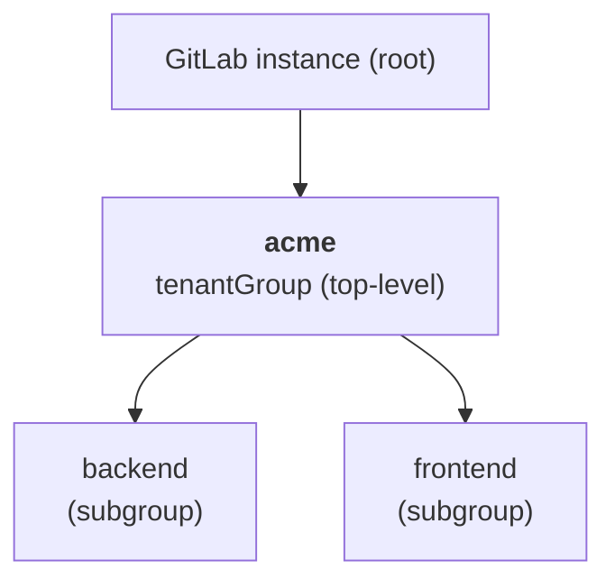
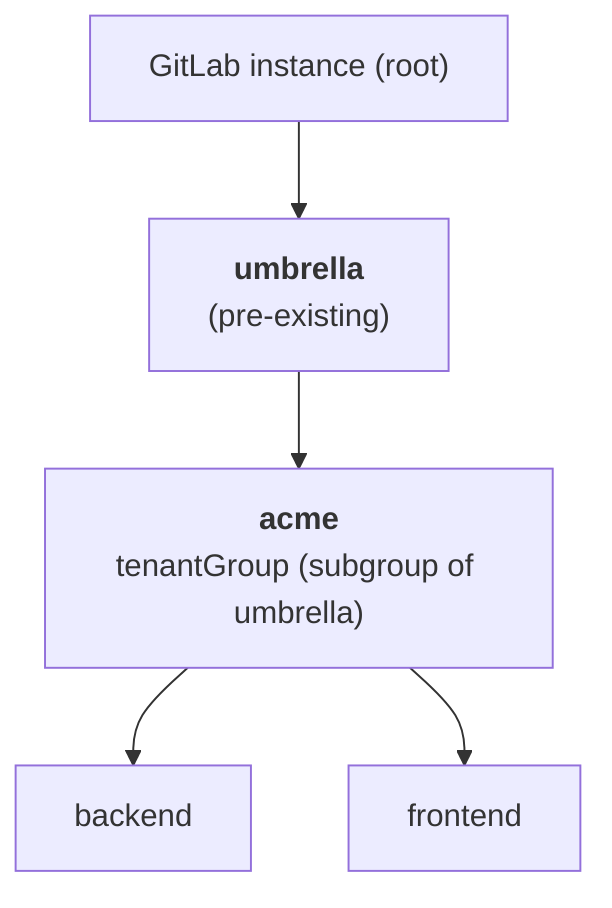
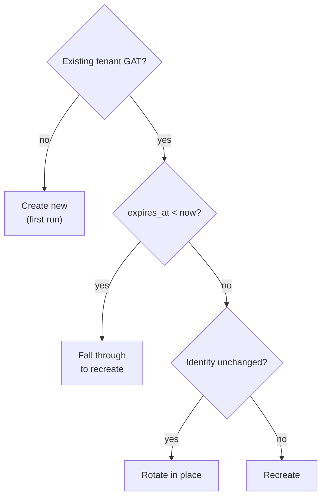

# GitLab CLI Configuration and Auto-Creation Patterns

This concept page describes how the `gitlab-connector-automatic-creation`
Tekton Task consumes a GitLab admin Connector through the `gitlabconfig`
CSI mount, the two supported deployment patterns (Pattern A vs Pattern B),
the three-path Group Access Token (GAT) lifecycle, and the tenant-side
surface the Task lands in the cluster.

For the overall GitLab Connector and its other configurations
(`gitconfig`, `gitlabconfig` for client workloads), see
[GitLab Connector](./gitlab_connectorclass.mdx). This page focuses on
how the auto-creation Task uses `gitlabconfig` server-side.

## What the Task Does

The `gitlab-connector-automatic-creation` Task takes one **admin** GitLab
Connector and reconciles a tenant's GitLab tenancy in a single TaskRun:

- Creates or reuses a tenant GitLab group at `tenantGroup` and any
  optional per-team `subgroups` under it.
- Provisions a Group Access Token at the tenant group with the requested
  `accessLevel` and `scopes`.
- Lands a tenant `gitlab` Connector + matching auth Secret of class
  `connectors.cpaas.io/gitlab-pat-auth` on the cluster.

Re-running the same TaskRun is idempotent: unchanged inputs rotate the
GAT in place; identity-affecting input changes drive a controlled
recreate; an already-expired GAT is recovered automatically (self-healing
on missed rotations).

## How the Admin Credential Stays in the Mount

The Task never reads the raw admin PAT or GAT into the Pod environment.
Instead, the admin Connector is consumed through Connectors CSI:

```yaml
workspaces:
  - name: gitlabconfig
    csi:
      driver: connectors-csi
      readOnly: true
      volumeAttributes:
        connector.name: gitlab-admin
        configuration.names: gitlabconfig
```

The CSI driver renders a `glab` `config.yml` whose `host` points at the
Connectors proxy Service of the admin Connector (e.g.
`c-gitlab-admin.connectors-management.svc.cluster.local`). The token
material recorded in that `config.yml` is a short-lived Kubernetes API
token used to **call the proxy**, not the original admin PAT/GAT. The
proxy is what holds the admin credential; it injects the real
`PRIVATE-TOKEN` header into outbound GitLab API calls server-side.

This means:

- The Pod never sees the admin PAT/GAT value.
- Pod logs cannot accidentally leak the admin credential.
- Whoever controls the proxy controls the admin credential — keep
  the admin Connector in a private management namespace, and gate the
  ServiceAccount that runs the TaskRun.

## Pattern A vs Pattern B \{#pattern-a-vs-pattern-b}

The Task is **deployment-pattern-agnostic**: it makes `glab` API calls and
trusts GitLab to enforce the resulting permissions. The two supported
patterns differ only in what kind of credential the admin Connector
carries and where the tenant group sits in the GitLab namespace tree.

**Pattern A — top-level + `can_create_group` user PAT**



- **Admin user PAT** — creates `acme`; the user becomes Owner because it is the creator.
- **Blast radius** — every group this user owns instance-wide.

**Pattern B — subgroup of umbrella + admin user PAT with Owner on umbrella**



- **Admin user PAT** — the user is a direct Owner of `umbrella`, which lets it create subgroups beneath it AND mint per-tenant GATs on those subgroups. GAT-creation requires direct Owner membership; Group Access Tokens cannot satisfy that requirement (see the sidebar below).
- **Blast radius** — the umbrella subtree only.

| Aspect | Pattern A | Pattern B |
|---|---|---|
| Admin Connector credential | User PAT | **User PAT** (a Group Access Token does NOT work — see note below) |
| `tenantGroup` shape | Top-level path (`acme`) | Subgroup path (`umbrella/acme`) |
| GitLab user with elevated flag? | Yes — `can_create_group` | No (but must be direct Owner of the umbrella) |
| Recommended for | Greenfield self-hosted GitLab | Orgs with an umbrella group / SaaS GitLab |
| Blast radius if compromised | Every group the user owns | Umbrella subtree only |
| Works on GitLab.com SaaS | Yes (any user can create top-level groups) | Yes |

> **Why not a Group Access Token (GAT) on the umbrella?** A GAT belongs
> to a group bot user that GitLab restricts to its issuance group. The
> bot can create subgroups (Maintainer is enough for that) but cannot
> mint GATs on those subgroups: GAT-creation endpoints require *direct*
> Owner membership, group bots cannot be added as members of other
> groups (`HTTP 400 — project bots cannot be added to other groups`),
> and group-share does not satisfy the direct-Owner check either.
> Pattern B therefore uses a regular user identity that is added as
> Owner of the umbrella once, then mints per-tenant subgroup GATs as
> that user.

The Task does **not** validate the admin identity type at param-parse
time. It calls the GitLab API and surfaces GitLab's verbatim error if the
admin lacks the required permission. This keeps the Task simple — GitLab
is the only authority on what the admin identity can do.

## Three-Path GAT Lifecycle \{#three-path-gat-lifecycle}

Each TaskRun decides between three paths based on the existing tenant GAT
state and the input parameters:

1. **Rotate in place.** Inputs unchanged and an existing healthy GAT was
   found at `tenantGroup` whose name matches `connector-<connector-namespace>-<connector-name>`.
   The Task calls `POST /groups/:id/access_tokens/:token_id/rotate`,
   GitLab atomically invalidates the old token value and returns a fresh
   one, and the tenant Secret is updated in place. The Connector resource
   is unchanged. Annotation `connectors.cpaas.io/gat-rotated-at` records
   the rotation timestamp.
2. **Recreate.** An identity-affecting input changed (`scopes`,
   `accessLevel`, or `subgroups[]` set). The Task revokes the existing
   GAT (`DELETE /groups/:id/access_tokens/:token_id`) and mints a fresh
   one with the requested attributes; the tenant Secret is rewritten;
   annotation `connectors.cpaas.io/gat-recreated-at` records the
   recreation timestamp.
3. **Expired-fall-through.** The GAT existed but its `expires_at` is
   already in the past (the previous rotation cron missed its window).
   GitLab's rotate endpoint would return `400 invalid_grant`, so the
   Task **falls through** to the recreate path automatically. The
   TaskRun reports `Succeeded`. **No manual operator intervention is
   required.** The how-to's
   [Operations runbook](../how_to/using_gitlab_connector_automatic_creation_task.mdx#operations-runbook)
   covers the alerting that should detect the missed-rotation window.

The decision tree below summarises the three paths:



## Tenant-Side Surface

After a successful TaskRun, the cluster contains:

- **Secret** of type `connectors.cpaas.io/gitlab-pat-auth` in the
  connector namespace, with `data.token` carrying the latest GAT value
  and `data.username` set to the GAT's name.
- **Connector** of class `gitlab` in the same namespace, with
  `spec.address` pointing at the GitLab instance, `spec.auth.name` set
  to `patAuth`, and `spec.auth.secretRef.name` pointing at the Secret
  above.

Tenant workloads in any namespace consume this Connector through the
existing `gitconfig` and `gitlabconfig` configurations — the same surface
that handcrafted GitLab Connectors expose. See
[GitLab Connector](./gitlab_connectorclass.mdx) for tenant-side mount
patterns and the
[Using GitLab CLI (glab) with GitLab Connector](../how_to/using-glab-cli.mdx)
guide for tenant-side examples.

## Optional: `kubeconfig` Workspace for Cross-Cluster Apply

The Task also supports an optional `kubeconfig` workspace. When bound,
the apply step exports `KUBECONFIG` from the workspace and applies the
tenant Connector + Secret against that cluster instead of the in-cluster
ServiceAccount context. Use this when:

- The management namespace runs on a control-plane cluster but the tenant
  Connector should land on a separate workload cluster.
- You want tighter RBAC on the local SA — the `kubeconfig` workspace can
  carry a different identity scoped to just the connector namespace.

The workspace is provided either as a Kubernetes Secret containing
`kubeconfig`, or via Connectors CSI from a `kubernetes`-class Connector:

```yaml
- name: kubeconfig
  csi:
    driver: connectors-csi
    readOnly: true
    volumeAttributes:
      connector.name: target-cluster
      configuration.names: kubeconfig
```

When the workspace is unbound, the apply step uses the in-cluster
ServiceAccount context; the SA needs RBAC to create Secrets and
Connectors in the connector namespace.

## Further Reading

- [Auto-Create GitLab Tenant Group + Connector with Tekton](../how_to/using_gitlab_connector_automatic_creation_task.mdx)
  — full how-to with TaskRun examples for Pattern A, Pattern B,
  rotate-in-place, recreate, and the expired-fall-through smoke.
- [`gitlab-connector-automatic-creation` Task reference](../how_to/gitlab_connector_automatic_creation_task.mdx)
  — full parameter, workspace, and result reference.
