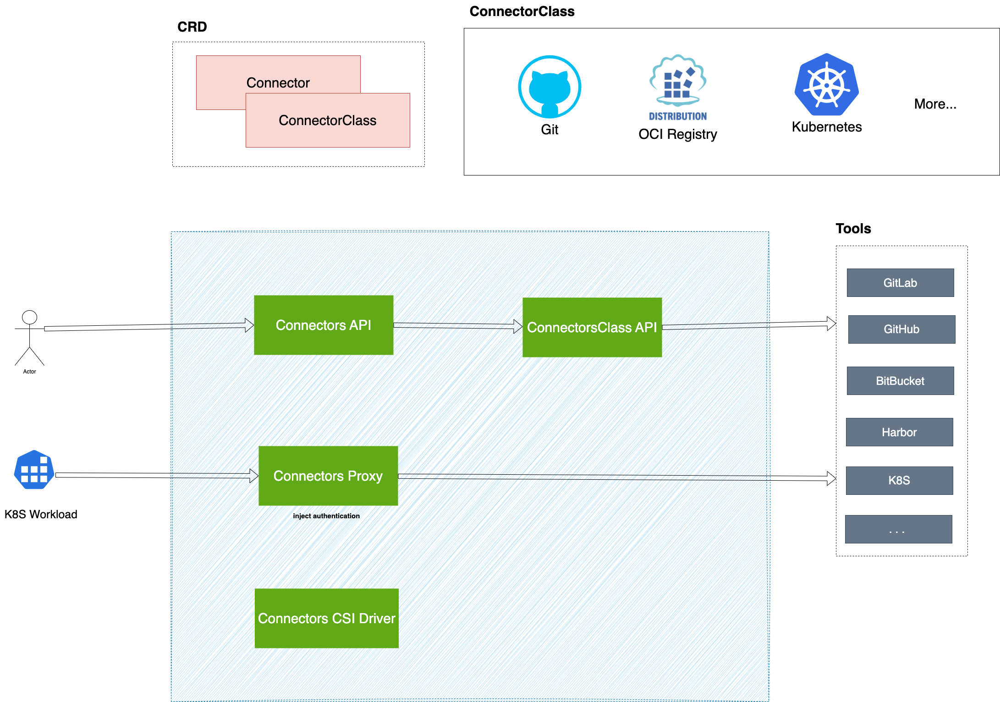

# Architecture

## Connector

`Connector` is a resource that represents an integrated instance of a specific tool. By configuring the tool's access URL and authentication information, we can create an instance for the tool's integration.

For example, integrating `https://github.com` using a `GitHub Private Access Token` is achieved through a `Connector`.

In `Kubernetes`, `Connector` is a namespace-level custom resource. Users can create multiple `Connectors` within the same namespace to integrate different tools.

For instance, within the `default` namespace, it is possible to create both a `Connector` for integrating `https://github.com` and a `Connector` for integrating `https://example.harbor.com/`.

Platform administrators can manage tool integrations across the cluster by managing `Connector` resources.

## ConnectorClass

`ConnectorClass` defines the access methods and behavior specifications for specific types of tools. It stipulates the parameters required when integrating with a certain type of tool, such as tool address and authentication information.

For example, the `Git ConnectorClass` defines the configuration items that need to be provided when integrating with Git tools, including the Git service's address and `Basic-Auth` authentication information.

In `Kubernetes`, `ConnectorClass` is a cluster-level custom resource. Developers can extend the types of tools supported by the platform by defining new `ConnectorClasses`.

For example, a `Harbor ConnectorClass` can be defined to support integration with the Harbor image repository, a `MySQL ConnectorClass` can be defined to support integration with MySQL databases, or a `Jira ConnectorClass` can be defined to support integration with Jira project management tools.

## Connectors Proxy

`Connectors Proxy` is a core capability of the Connectors system that provides secure, secretless access to integrated tools. It typically operates as an HTTP service that can function as either a forward proxy or a reverse proxy for client applications.

When clients access tool resources through `Connectors Proxy`, the proxy automatically injects the necessary authentication credentials into requests, enabling seamless access without requiring clients to handle credentials directly. This approach delivers a significant security benefit:

- **Secretless Access**: Eliminates the need to distribute tool credentials directly to clients by using short-lived tokens issued by Kubernetes. This prevents credential exposure in client environments such as logs or environment variables.

To accommodate diverse tool authentication requirements, the platform supports both built-in and custom proxy implementations. Each `ConnectorClass` can provide its own proxy service, offering flexibility to meet specific tool authentication needs.

### Built-in Connectors Proxy

The built-in implementation provides comprehensive HTTP/HTTPS protocol support with Basic Auth and Bearer Token authentication methods. It offers both forward and reverse proxy capabilities for maximum flexibility.

**Used by ConnectorClass**: K8s ConnectorClass, Git ConnectorClass

### Custom Connectors Proxy

For tools requiring specialized authentication mechanisms, custom proxy implementations can be developed. 

**Example**: The OCI ConnectorClass utilizes a custom OCI Plugin Proxy supporting OCI protocol with Bearer Token authorization for registries like Harbor and CNCF Distribution Registry.

- More information: [Connectors Proxy](../concepts/connectors_proxy.mdx)

### Permission Control for Connectors Proxy

`Connectors Proxy` represents real runtime access to the target tool. In practice, this affects whether a workload can clone from a repository, pull or push artifacts, or otherwise use the Connector in a secretless runtime path.

Permission control for `Connectors Proxy` takes effect only when the `enable-connector-proxy-permissions` feature flag is enabled.
By default, when this feature flag is disabled, a client only needs `get` permission on the `Connector` resource to use that Connector through `Connectors Proxy`.

Because `Connectors Proxy` represents real runtime access to the target tool, proxy access is usually treated as the more sensitive part of the permission model. A client may be allowed to see a Connector, but still be unable to use its proxy endpoint.

`Connectors Approval` is built on top of this proxy permission control. Its role is to further decide whether a workload may be granted `Connectors Proxy` usage for a protected Connector.

For a more detailed explanation of how this fits into the overall permission split, see [Connectors Permission Model](../concepts/permission_model.mdx). 

## Connectors API

`Connectors API` provides capabilities for accessing internal tool resources based on `Connector` instances. For example, for a `Git Connector`, the `Connectors API` can retrieve the list of branches (References) in a Git repository.

Developers can conveniently access resources within tools via the `Connectors API` without needing to concern themselves with specific tool addresses and authentication details.

The system supports two ways to access tool resources through the API:

- **Original Tool API**: When the ConnectorClass provides Proxy Service capabilities, clients can directly access the tool's original API through the Connector API. The system automatically forwards requests to the tool's Proxy Service, completes authentication injection, and returns the original data from the tool.
- **Custom API**: Use custom APIs provided for the ConnectorClass, which offer extended capabilities beyond the tool's original API.

This API is very useful in practical applications, such as:

- Retrieving the list of tags for container images when creating applications
- Getting the list of branches (References) for a code repository during a Git Clone operation
- Accessing tool-specific APIs directly when the ConnectorClass supports Proxy Service

The implementation of the `Connectors API` is based on the underlying capabilities provided by the `ConnectorClass API`.

### Permission Control for Connectors API

`Connectors API` is commonly used for read-oriented discovery scenarios, especially in platform UI flows. Typical examples include listing branches, tags, projects, repositories, or other selector data from the target tool.

Permission control for `Connectors API` takes effect only when the `enable-connector-apis-permissions` feature flag is enabled.
By default, when this feature flag is disabled, a client only needs `get` permission on the `Connector` resource to use that Connector through `Connectors API`.

When `enable-connector-apis-permissions` is enabled, a user may be able to discover a `Connector`, but still be unable to browse tool data through `Connectors API` if their role does not allow that capability.

In Alauda Container Platform (ACP), built-in user-facing roles typically already include the read-oriented `Connectors API` permissions needed for common UI scenarios such as branch, tag, project, and repository selection.

This separation allows the platform to keep Connector discovery convenient while still controlling which users may query tool data through the API path. For a more detailed explanation, see [Permissions for Connectors API](../concepts/permission_model.mdx#connectors-api-permissions).

## Connectors Permission Model

The Connectors system separates resource permissions from capability permissions.

- Resource permissions on `Connector` and `ConnectorClass` control who can discover or manage integration definitions.
- Capability permissions control who can use those definitions through `Connectors API` or `Connectors Proxy`.

This split allows a platform to make Connectors discoverable without automatically granting runtime access to the underlying tool.

Within this model, `Connectors Approval` only applies when a workload uses a Connector through `Connectors Proxy`. In other words, it controls whether the workload may actually use that Connector to complete runtime actions such as clone, pull, push, or deployment, and grants that access only after the required checks pass.

For a detailed explanation of how users experience this model and how built-in Alauda Container Platform (ACP) permissions affect it, see [Connectors Permission Model](../concepts/permission_model.mdx).

## ConnectorClass API

`ConnectorClass API` defines the APIs provided by specific types of tools.

Different types of tools can offer various API capabilities, for example:

- The `Git ConnectorClass API` can provide the capability to retrieve the list of branches for a code repository
- The `OCI ConnectorClass API` can provide the capability to retrieve the list of tags for artifact repositories

Developers can define unique API capabilities for each `ConnectorClass`, and these capabilities will ultimately be exposed to clients through the `Connectors API`.

## Connectors CSI Driver

To facilitate easier utilization of Connectors-Proxy capabilities by K8S workloads, we can use the Connectors CSI Driver.

The Connectors CSI Driver can mount the rendered contents of the configuration file templates maintained within the ConnectorClass into the workload. The configuration file can include information for accessing the `Connectors Proxy`, enabling users to utilize Connectors Proxy capabilities with minimal modifications to their original scripts.

For more information, refer to [connectors csi driver](../concepts/connectors_csi.mdx)

## Connectors Approval & Permission Gating

`Connectors Approval & Permission Gating` extends the standard Connector permission model for sensitive operations. It uses `AccessPolicy` to define who can use Connectors through `Connectors Proxy`, either by granting `defaultPermission` immediately or by granting proxy access only after approval-related checks pass.

The feature depends on both `enable-connectors-approval` and `enable-connector-proxy-permissions`.

If these feature flags are not enabled together, the approval-specific flow is not active.

- If `enable-connector-proxy-permissions` is disabled, the system does not apply the proxy capability permission layer, so approval cannot gate proxy usage.
- If `enable-connectors-approval` is disabled, the system does not create or evaluate the approval-specific runtime flow.

In that case, workloads use the normal Connector access model instead of approval-gated proxy access.

If users do not want to gate the use of a Connector, they can still create an `AccessPolicy` with `defaultPermission`, so matched workloads can use the Connector through `Connectors Proxy` without waiting for approval checks.

`Connectors Approval & Permission Gating` is built around two complementary resources:

- `AccessPolicy`, which defines which Connectors are covered, what access is granted by default, and what proxy access requires checks
- `AccessRequest`, which records one workload's attempt to use a Connector and tracks matched policies, check results, and temporary permission status

A common flow is that a Pod or pipeline task mounts a Connector through the Connectors CSI Driver, the system evaluates the matching `AccessPolicy`, creates or updates an `AccessRequest` for that workload, waits for the required checks, grants `Connectors Proxy` access for the workload, and later revokes it when the workload completes.

`Connectors Approval & Permission Gating` is intended for scenarios such as artifact promotion to a production registry or other protected tool operations, where discovery and actual use should be controlled separately.

For a step-by-step explanation of this capability, see [Connectors Approval & Permission Gating](../concepts/connectors_approval.mdx), then [AccessPolicy](../concepts/access_policy.mdx), and finally [AccessRequest](../concepts/access_request.mdx).

## ResourceInterface

`ResourceInterface` is a standardized abstraction that defines how external resources (like Git repositories, OCI container images, artifact repositories) can be integrated into pipeline workflows.

When building CI/CD pipelines, users traditionally need to manually configure resource URLs, git branch/tag, OCI image tag, artifact repository, and authentication credentials for different external tools. This manual process is complex, error-prone, and makes pipeline configurations tightly coupled to specific tool instances.

ResourceInterface solves this by providing standard resource abstraction like "GitCodeRepository", "OCIArtifact", and "MavenArtifact". Instead of manually entering URLs like `https://github.com/myorg/myapp.git`, users can select a connector, browse resources through the UI, and the system automatically generates the correct configuration and credentials for the pipeline.

This approach provides a consistent, user-friendly experience across different tools while maintaining flexibility to support various implementations.

For more information, refer to [ResourceInterface](../concepts/resource_interface.mdx).

If you want to integrate Connector in your custom Pipeline or Task, please refer to <ExternalSiteLink name="pipelines" href="/pipelines/concepts/integrate_with_connector.html" children="Pipeline Integration" />
