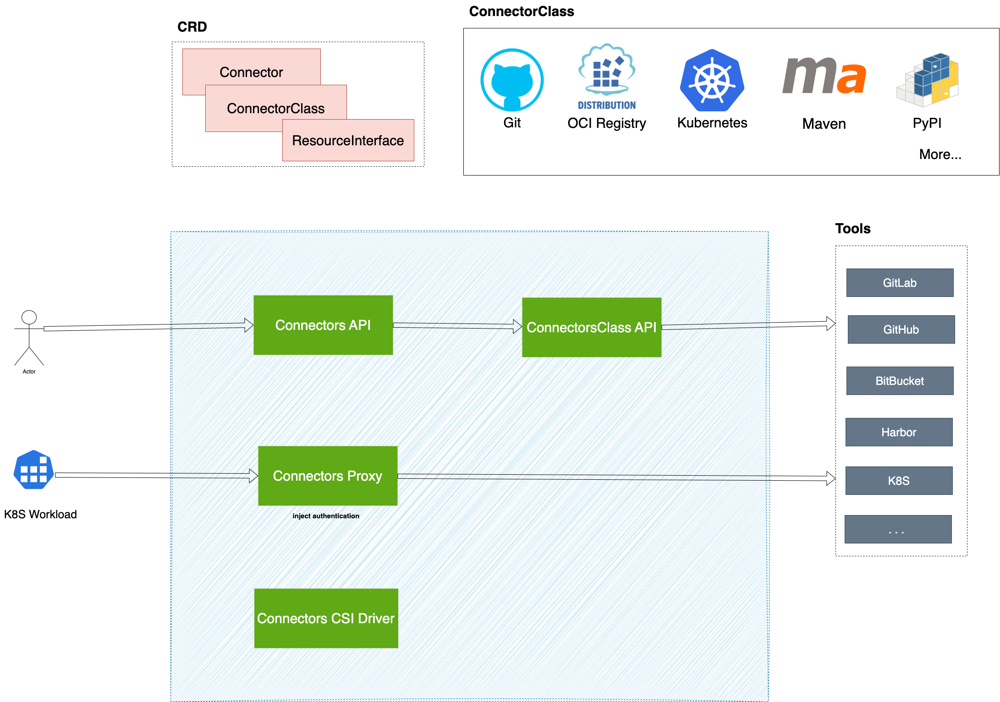

# Architecture

## Connector

`Connector` is a resource that represents an integrated instance of a specific tool. By configuring the tool's access URL and authentication information, we can create an instance for the tool's integration.

For example, integrating `https://github.com` using a `GitHub Private Access Token` is achieved through a `Connector`.

In `Kubernetes`, `Connector` is a namespace-level custom resource. Users can create multiple `Connectors` within the same namespace to integrate different tools.

For instance, within the `default` namespace, it is possible to create both a `Connector` for integrating `https://github.com` and a `Connector` for integrating `https://hub.docker.com/`.

Platform administrators can manage tool integrations across the cluster by managing `Connector` resources.

## ConnectorClass

`ConnectorClass` defines the access methods and behavior specifications for specific types of tools. It stipulates the parameters required when integrating with a certain type of tool, such as tool address and authentication information.

For example, the `Git ConnectorClass` defines the configuration items that need to be provided when integrating with Git tools, including the Git service's address and `Basic-Auth` authentication information.

In `Kubernetes`, `ConnectorClass` is a cluster-level custom resource. Developers can extend the types of tools supported by the platform by defining new `ConnectorClasses`.

For example, a `Harbor ConnectorClass` can be defined to support integration with the Harbor image repository, a `MySQL ConnectorClass` can be defined to support integration with MySQL databases, or a `Jira ConnectorClass` can be defined to support integration with Jira project management tools.

## Connectors Proxy

`ConnectorsProxy` is a core component that provides secure, secretless access to integrated tools within Kubernetes clusters. It acts as a proxy server, handling authentication injection and request routing to target tool.

`ConnectorsProxy` enables clients to access tool resources without direct credential handling. This approach delivers significant security benefits:

- **Secretless Access**: Eliminates the need to distribute tool credentials directly to clients by using short-lived tokens issued by ServiceAccount. This prevents credential exposure in clients like logs or environment variables.
- **Centralized Credential Management**: All tool credentials are managed centrally by connectors, and no need to distribute credentials to each client.

The platform supports both built-in and custom proxy implementations to accommodate diverse tool authentication requirements.

### Built-in Connectors Proxy

The built-in implementation provides comprehensive HTTP/HTTPS protocol support with Basic Auth and Bearer Token authentication methods. It offers both forward and reverse proxy capabilities for maximum flexibility.

**Used by ConnectorClass**: K8s ConnectorClass, Git ConnectorClass

### Custom Connectors Proxy

For tools requiring specialized authentication mechanisms, custom proxy implementations can be developed. 

**Example**: The OCI ConnectorClass utilizes a custom OCI Plugin Proxy supporting OCI protocol with Bearer Token authorization for registries like Harbor and Docker Registry.

More information: [Connectors Proxy](../concepts/connectors_proxy.mdx)

## Connectors API

`Connectors API` provides capabilities for accessing internal tool resources based on `Connector` instances. For example, for a `Git Connector`, the `Connectors API` can retrieve the list of branches (References) in a Git repository.

Developers can conveniently access resources within tools via the `Connectors API` without needing to concern themselves with specific tool addresses and authentication details.

The system supports two ways to access tool resources through the API:

- **Original Tool API**: When the ConnectorClass provides Proxy Service capabilities, clients can directly access the tool's original API through the Connector API. The system automatically forwards requests to the tool's Proxy Service, completes authentication injection, and returns the original data from the tool.
- **Custom API**: Use custom APIs provided for the ConnectorClass, which offer extended capabilities beyond the tool's original API.

This API is very useful in practical applications, such as:

- Retrieving the list of tags for container images when creating applications
- Getting the list of branches (References) for a code repository during a Git Clone operation
- Accessing tool-specific APIs directly when the ConnectorClass supports Proxy Service

The implementation of the `Connectors API` is based on the underlying capabilities provided by the `ConnectorClass API`.

## ConnectorClass API

`ConnectorClass API` defines the APIs provided by specific types of tools.

Different types of tools can offer various API capabilities, for example:

- The `Git ConnectorClass API` can provide the capability to retrieve the list of branches for a code repository
- The `OCI ConnectorClass API` can provide the capability to retrieve the list of tags for artifact repositories

Developers can define unique API capabilities for each `ConnectorClass`, and these capabilities will ultimately be exposed to clients through the `Connectors API`.

## Connectors CSI Driver

To facilitate easier utilization of Connectors-Proxy capabilities by K8S workloads, we can use the Connectors CSI Driver.

The Connectors CSI Driver can mount the rendered contents of the configuration file templates maintained within the ConnectorClass into the workload. The configuration file can include information for accessing the `Connectors Proxy`, enabling users to utilize Connectors Proxy capabilities with minimal modifications to their original scripts.

For more information, refer to [connectors csi driver](../concepts/connectors_csi.mdx)

## ResourceInterface

`ResourceInterface` is a standardized abstraction that defines how external resources (like Git repositories, OCI container images, artifact repositories) can be integrated into pipeline workflows.

When building CI/CD pipelines, users traditionally need to manually configure resource URLs, git branch/tag, OCI image tag, artifact repository, and authentication credentials for different external tools. This manual process is complex, error-prone, and makes pipeline configurations tightly coupled to specific tool instances.

ResourceInterface solves this by providing standard resource abstraction like "GitCodeRepository", "OCIArtifact", and "MavenArtifact". Instead of manually entering URLs like `https://github.com/myorg/myapp.git`, users can select a connector, browse resources through the UI, and the system automatically generates the correct configuration and credentials for the pipeline.

This approach provides a consistent, user-friendly experience across different tools while maintaining flexibility to support various implementations.

For more information, refer to [ResourceInterface](../concepts/resource_interface.mdx).

If you want to integrate Connector in your custom Pipeline or Task, please refer to <ExternalSiteLink name="pipelines" href="/pipelines/concepts/integrate_with_connector.html" children="Pipeline Integration" />
