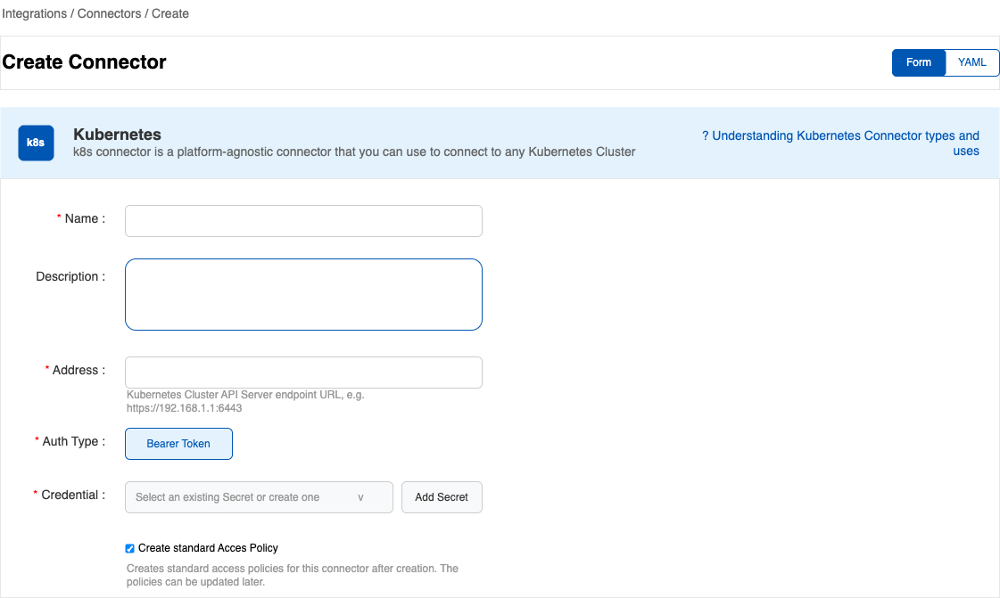
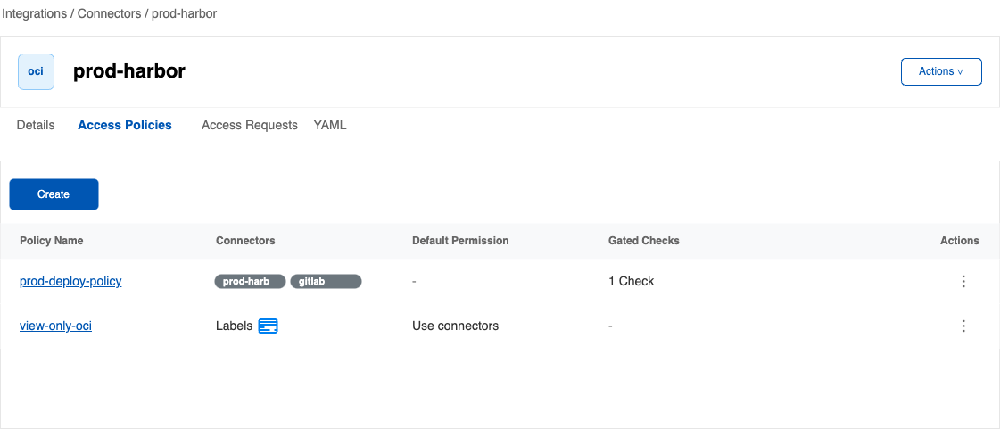
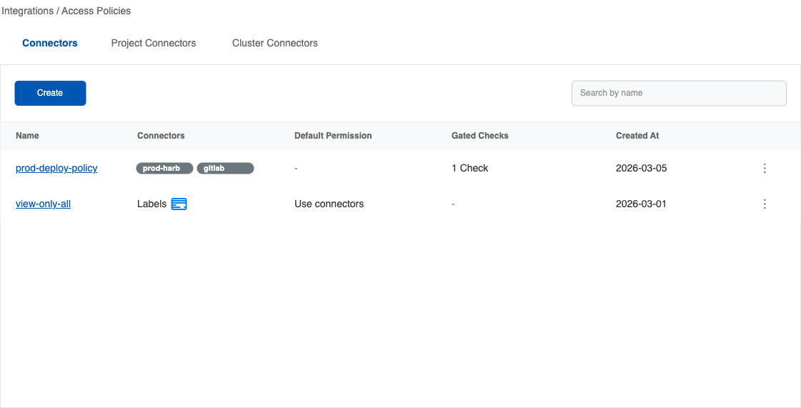
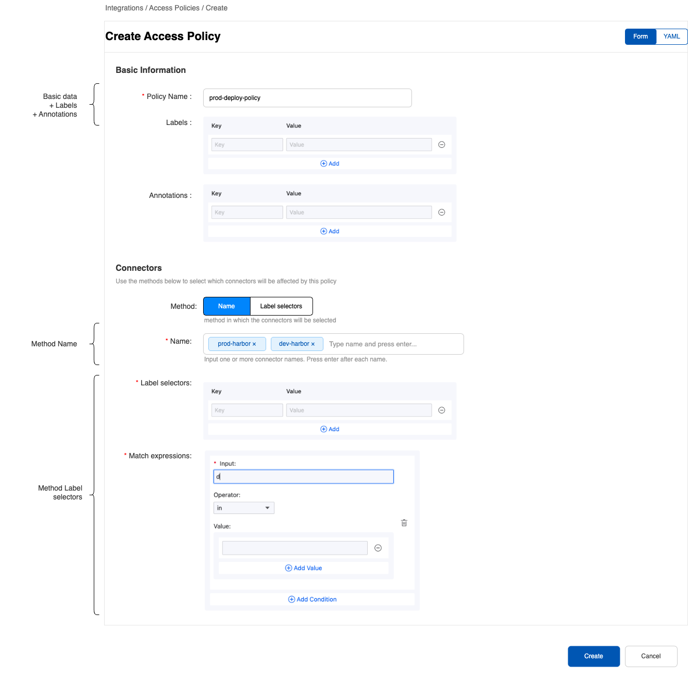
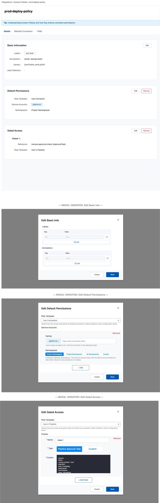
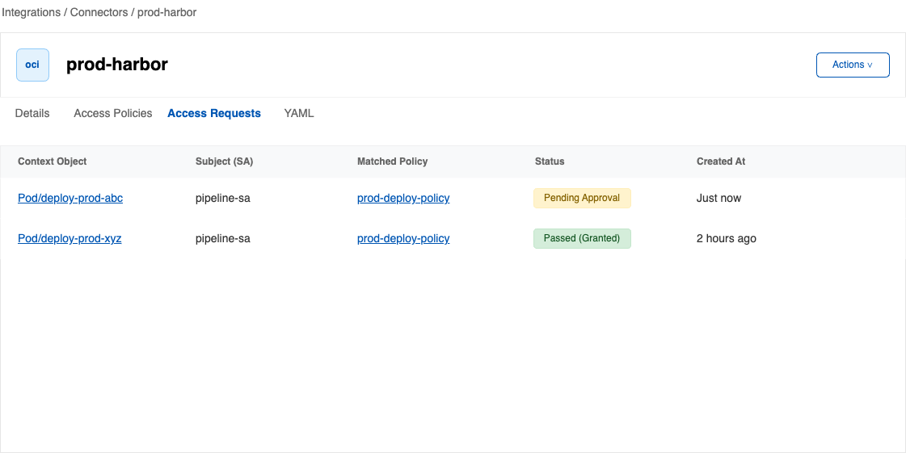

# Connectors Approval & Permission Gating - Product Design

## 1. Overview
The **Connectors Approval** feature introduces a gating mechanism to control access to Connectors (e.g., Git, Harbor, OCI registries) used within the cluster. It ensures that consumers (like CI/CD pipelines or workloads) only receive access to Connectors after satisfying pre-defined approval checks (such as a Tekton `ApprovalTask`). It enforces the principle of least privilege by granting temporary, narrowly-scoped permissions (via dynamic RBAC) based on successful approvals, and revoking them immediately when the workload lifecycle ends.

Common scenarios include "Open to all" (default permissions) and "Use after approval" (gated access).

## 2. Personas
- **Platform / Security Admin:** Manages advanced YAML configurations, cluster-wide policies, and customized permissions.
- **Project Admin:** Configures AccessPolicies for specific projects (matching multiple namespaces via label selectors like `cpaas.io/project`).
- **Namespace Admin:** Configures AccessPolicies within a specific namespace, mapping service accounts to Connector access.
- **Developer / Pipeline User:** Triggers workloads (e.g., PipelineRuns or Pods) that require Connector access. Expects seamless integration where access is automatically requested.
- **Approver:** A designated user/manager who reviews and approves/rejects the `ApprovalTask` in the CI/CD pipeline.

## 3. Core Entities & UI Relationships
- **Connectors & AccessPolicy (Many-to-Many):** A single Connector can match multiple policies, and a single Policy can apply to multiple Connectors.
  - **Connector Details UI:** Displays a list of applied policies and provides an entry point to add a new policy.
  - **Policy List UI:** An independent list view for managing all `AccessPolicy` resources.
  - **Policy Details UI:** Displays a list of all Connectors that currently match the policy.
  - :::note
    **New Update:** When creating a connector, a standard Access Policy will automatically be created to allow matching service accounts based on the connector's scope (Namespace, Project, or Cluster).
    :::
- **AccessPolicy (CRD):** Defines rules matching target Connectors to required checks and permissions. Matching uses label selectors (`matchLabels`, `matchExpressions`) or explicit `names` (which take highest priority).
  - To enforce security, **Role Templates** use built-in, pre-defined templates (e.g., `useConnector`, `useInPipelineRun`) ensuring that `apiGroups` and `resources` are strictly whitelisted. Custom rule expansion will be supported via configuration in the future.
  - **Checks** can be defined inline (`spec` - for advanced YAML users) or by reference (`ref` - displayed and managed in the UI).
  - :::note
    **New Update:** The Access Policy management is now split into three tabs: **Details**, **Matched Connectors**, and **YAML**. The Details tab includes separate cards for Basic Info, Default Permissions, and Gated Access. Each card has an Edit button (and a Remove button for permissions/access with a confirmation modal). Creating an Access Policy only requires basic info and connector selection initially.
    :::
  - **Default Permissions Conditions:**
    1. Namespace connectors: `Current Namespace`, `Custom` options.
    2. Project connectors: `Project Namespaces`, `Custom` options.
    3. Cluster connectors: `Current Namespace`, `All Namespaces`, `Custom` options.
- **AccessRequest (CRD):** Represents an active request by a workload (Subject/Context Object) to access a specific Connector, tracking the status of associated checks and permission syncing.
- **Check Duck Type:** A generic interface (e.g., `ApprovalTask`, `ApprovalRequest`). The state is evaluated natively by checking `status.conditions[]` where `type == Ready || type == Succeeded` (values: `Unknown` = Pending, `False` = Rejected, `True` = Passed/Approved). It also supports custom evaluation via `rego` expressions.
- **CSI Driver:** Intercepts volume mount operations for Connectors and automatically initiates an `AccessRequest` if the requesting workload lacks necessary permissions.

## 4. User Stories

### 4.1 Define Connector Access Policies

**As a** Namespace/Project Admin/Cluster Admin,
**I want to** create `AccessPolicy` rules for specific Connectors using UI-friendly built-in templates (e.g., `useConnector`),
**So that** I can easily configure default access or enforce manual approval workflows without writing complex RBAC YAML.

### 4.2 Automatic Access Request via CSI
**As a** Pipeline User,
**I want** the system to automatically request access when my Pod tries to mount a Connector,
**So that** I don't have to manually write access request manifests in my pipeline definitions.

### 4.3 Gated Access & Temporary Permission Granting
**As a** Security Admin,
**I want** permissions to be granted via safe, built-in Role Templates strictly scoped to the requesting workload (specific Pod context) and automatically revoked once the workload finishes,
**So that** we prevent lateral privilege escalation and maintain a strict least-privilege security posture.


### 4.4 Automatic Default Access Policy Creation
**As a** Namespace/Project/Cluster Admin,
**I want** a default `AccessPolicy` to be automatically created when I create a new Connector through the UI with the toggle enabled,
**So that** all Service Accounts within the Connector's respective scope (Namespace, Project, or Cluster) are instantly granted standard access without requiring me to manually configure a policy.

## 5. BDD Scenarios (Given-When-Then)

### Feature: Automatic Policy Generation on Connector Creation

**Scenario:** Creating a Namespace-scoped Connector with default policy toggle
- **Given** a Namespace Admin is creating a new `git` Connector in the `default` namespace via the UI
- **And** the "Automatically create standard Access Policy" toggle is enabled
- **When** the Connector is successfully saved
- **Then** the system should automatically generate a corresponding `AccessPolicy` bound to the new Connector
- **And** the policy should have Default Permissions enabling the `useConnector` role template
- **And** the policy should apply to all Service Accounts strictly within the `default` namespace.

**Scenario:** Creating a Project-scoped Connector with default policy toggle

- **Given** a Project Admin is creating a new `oci` Connector via the UI
- **And** the "Automatically create standard Access Policy" toggle is enabled
- **When** the Connector is successfully saved
- **Then** the system should automatically generate a corresponding `AccessPolicy`
- **And** the Default Permissions should target `Group: system:serviceaccounts` scoped via a `namespaceSelector` matching the specific Project (e.g., `cpaas.io/project: devops`).

### Feature: Default permission in Access Policy
**Scenario:** Access Policy allow default permissions on connector
- **Given** an `AccessPolicy` exists with Default Permissions on `gitlab-connector` for all Service Accounts in the namespace
- **When** a TaskRun's pod accesses the connector via Workspaces
- **Then** the Access is granted and the Pod can access the connector functionalities and target tool APIs.

### Feature: Access Policy Evaluation and Request Initialization
**Scenario:** Workload requests access and matches an AccessPolicy
- **Given** an `AccessPolicy` exists requiring a `manual-approval-check` (ApprovalTask) for the `prod-harbor` connector
- **And** a Pipeline has an `ApprovalTask` before pushing an image into `prod-harbor` using a task
- **And** a PipelineRun was triggered and approved and a Pod attempts to mount the `prod-harbor` connector without sufficient existing permissions
- **When** the CSI driver intercepts the mount
- **Then** the CSI driver should automatically create an `AccessRequest` bound to the Pod's context
- **And** the `AccessRequest` status should reflect that the policy is matched (`AccessPolicyMatched` = True)
- **And** the `AccessRequest` should map to the corresponding `ApprovalTask` in the pipeline and allows CSI Driver to mount.

### Feature: Approval Task Lifecycle & RBAC Granting
**Scenario:** Access is granted upon ApprovalTask approval
- **Given** an `AccessRequest` is in a `pending` state waiting for an `ApprovalTask`
- **When** the designated Approver approves the `ApprovalTask` (the `Check Duck Type` condition `Ready` or `Succeeded` evaluates to `True`)
- **Then** the `AccessRequest` condition `AccessCheckReady` should become `True` (Reason: `AccessCheckPassed`)
- **And** the system should automatically generate a `Role` and `RoleBinding` based on the built-in `useInPipelineRun` template
- **And** the permission scope MUST be strictly bound to the Pod's namespace and name (`connectors/apis/v1/pod/{ns}/{name}`)
- **And** the CSI driver should subsequently allow the volume mount to proceed.

**Scenario:** Access is denied upon ApprovalTask rejection
- **Given** an `AccessRequest` is in a `pending` state waiting for an `ApprovalTask`
- **When** the Approver rejects the `ApprovalTask` (the `Check Duck Type` condition `Ready` or `Succeeded` evaluates to `False`)
- **Then** the `AccessRequest` condition `AccessCheckReady` should become `False` (Reason: `AccessCheckRejected`)
- **And** no RBAC resources should be created
- **And** the CSI driver should fail the volume mount and cease retries.

### Feature: Project Administrator gives access to project connectors

**Scenario:** Applying a policy across a Project
- **Given** a Project Admin is configuring an `AccessPolicy`
- **When** they configure the Default Permission to target ServiceAccounts with a `namespaceSelector` for `cpaas.io/project: devops`
- **Then** the policy should automatically apply to all ServiceAccounts in any namespace belonging to the `devops` project.

**Scenario:** Permission denied from non-granted service accounts
- **Given** a Namespace Admin is configuring an `AccessPolicy`
- **And** they configure the Default Permissions and input specific ServiceAccount names (or leave empty for all)
- **When** a service account in a Pod from another unrelated namespace tries to access the connector
- **Then** it should be rejected and connector is not mounted until permission is granted or pod destroyed.

### Feature: Auto-revocation of Temporary Permissions

**Scenario:** Context object (Pod) completion triggers permission revocation
- **Given** an `AccessRequest` has successfully granted permissions to a Pod
- **When** the Pod completes its execution (succeeds or fails) or is deleted
- **Then** the `AccessRequest` Controller should detect that the Context Object is no longer running
- **And** the generated `Role` and `RoleBinding` should be automatically deleted
- **And** the `AccessRequest` should enter a terminal state preventing further reconciliation.

### Feature: Feature Toggle Enforcement

**Scenario:** Connectors approval is disabled globally
- **Given** the `enable-connectors-approval` feature flag is set to `false`
- **When** a Pod attempts to mount a Connector
- **Then** the CSI driver should bypass the `AccessRequest` creation entirely
- **And** the Pod should be granted or denied access based purely on pre-existing standard RBAC.

### Feature: Fine-grained API Permissions via Subresources

**Scenario:** Restricting specific HTTP methods via Role Verbs
- **Given** the `enable-connectors-apis-permissions` feature toggle is enabled
- **And** a Pod is granted a `Role` with the verb `read` for the `prod-harbor` connector API subresource
- **When** the workload attempts a `GET` request to the Connector's API
- **Then** the Connectors Proxy should evaluate the action as `read` and permit the request
- **When** the workload attempts a `POST` or `PUT` request to the Connector's API (**TO BE DISCUSSED**)
- **Then** the Connectors Proxy should evaluate the action as `write` and reject the request with a 403 Forbidden error.

## 6. Security & Audit Requirements

- **No Privilege Escalation:** Users cannot input arbitrary `apiGroups` or `resources` in their AccessPolicy. All grants are generated from whitelisted, built-in Role Templates (e.g., `useConnector`).
- **Context-Bound Grants:** Dynamically generated Roles MUST explicitly limit access using `resourceNames` (for the Connector) and specific resource paths (e.g., `connectors/apis/v1/pod/{ns}/{name}`) to prevent credential reuse across different workloads or pipelines.
- **Auditability:** All Role creations, RoleBinding attachments, and revocations performed by the `AccessPolicy` and `AccessRequest` controllers MUST be recorded as Kubernetes Events on the respective objects for audit trailing and troubleshooting.

## 7. Out of Scope (Initial Phase)

- Context objects other than `Pod` (e.g., Deployment, Job) are initially out of scope due to MutationWebhook validation constraints.
- Custom/arbitrary Role Template definitions (users must use built-in templates; expandability will be added in future versions).

## 7. UIUX

Access is given via:

1. Connector details with list
2. Access Policy list

:::note
**Recent Updates:**
1. Connectors Create UI now includes an option to automatically create a default Access Policy.
2. Access Policy list is split into three tabs (Connectors, Project Connectors, Cluster Connectors).
3. Access Policy creation is simplified to basic info, followed by detailed management in a tabbed details view.
:::


### Conectors creation

::: note
   Changes: Adds a switch (default enabled) to allow quick creation of `Access Policy` when creating Connector
:::




### Conectors details

::: note
   Changes: Add `Access Policies` and `Access Requests` tabs (below)
:::



### Access Policy list

::: note
   List is split into three tabs representing namespace, project, and cluster connectors.
:::



### Create Policy

::: note
   Simplified to only cover Basic Information (Name, Labels, Annotations) and Target Connectors.
:::



### Access Policy Details

::: note
   New detailed view with "Understanding Access Policies" tip bar, and tabs for Details, Default permissions, and Gated access. Includes modal variations for editing permissions.
:::



### Access Request list in connectors

::: note
   List of pending/approved `Access Requests` in Connectors details
:::

::: tip
   TBD: Good to have
:::




## 8. Future consideration

- Allowing more "out-of-the-box" permission roles and gate configuration is planned for future releases
  - Task specific check: Allows users to specify which specific `ApprovalTask` is the gate
  - More Quality gate related tasks check templates: Image and code scanning, Image signing, etc.


---

## Review meeting notes

### 2026-03-10

Overall design is ok, here are the needed adjustments:

1. **Automatically creaet Access Policy when Creating Connectors**

On the UI, it is necessary that, after creating a connector, a "standard" policy will be automatically created to follow our current behavior following these rules:

- **Namespace connectors**: Allows all service accounts from the same namespace to access.
- **Project connectors**: Allows all service accounts from different namespaces from the same project to access.
- **Cluster connectors**: Allows all service accounts in the cluster to access.

After creation, the same persona should be able to modify or delete the Access Policy. For that to happen, we will provide a UI tooltip/warning to the user regarding the newly created Access Policy.


2. **Access Policy management split in different parts**

When creating a policy the user the flow should work as:

- **User inputs basic info**: Name, labels, annotations
- **User select connector selection criteria**: Name or Label selectors
- **Create**: Resource is created and user is redirected to the **Access Policy** details UI.

At this point the policy does not have any effect, but already exists as a resource.

**Access Policy details**:

**Details tab**: Name, label, annotations, connector selection criteria and under it a list of affected connectors with name, type and status (read only)
**Default permission tab**: Default permission configuration details. Display empty state if not set.
**Gated access tab**: Gated access configuration details. Displays empty state if not set.


User can do the following actions:

- **Update info**: Updates Details tab info.
- **Update default permissions**: Set default permission configuration. Opens a new configuration form for default permissions (modal)
- **Updated gated access configuration**: Set gated access configuration information. Opens a new configuration form for gated access (modal)


#### Changes

Necessary changes to be made (Todo list):

1. Create Access Policy detailed page with all tabs and modal variations
2. Update create access policy page to only cover the basic data (adds labels and annotations, referece in prototypes/basic-info.png)
3. Update connectors create UI to add options to automatically create Access policy with description and link to docs
3. Change the core of the document with updates (update document and add a :::note block highligthing the changes)
4. Add "Understanding Access Policies" blue tip bar in Access Policy detailed page


### 2026-03-12

**Access Policy details**:

- Keep three tabs: Details, Matched Connectors, YAML. Matched Connectors displays the list of matched connectors, no action or buttons.
- Details tab: Make the individual parts as different cards (described below). Each card has an Edit button. Default permission and Gated Access cards have a Remove button that toggles a confirmation dialog alerting users.

**Details tab parts**

**Basic Info**: keep current design, remove matched connectors list
**Default Permissions**: Add default permissions data and buttons to the card as described above.
**Gated Access**: Add gated access data and buttons to the card as describe above.

all: Edit buttons will open an edit dialog with the details. For basic info, extract the form from `create access policy` form minus the name (non-editable)
Default Permissions and Gate Access cards: Remove button with confirmation modal

**Default Permissions conditions**:

When creating default permissions, there are the following conditions that must be applied:
1. Namespace connectors only have `Current Namespace` and `Custom` options
2. Project connectors only have `Project Namespaces` and `Custom` options
3. Cluster connectors only have `Current Namespace`, `All Namespaces` and `Custom` options


---

### Example yaml

Creating AccessPolicy:

```yaml
kind: AccessPolicy
spec:
  #### Select one or more connectors
  #### or
  #### Use label selection
  connector:
    selector:
      matchLabels:
        connectors.cpaas.io/connectorclass: oci
      names: [ "prod-harbor" ]

  ### Default permission settings (optional)
  defaultPermission:
    roleTemplate:
      ### Uses only built-in templates
      ### Can expand and override using configuration (next version)
      name: useConnector

    ### Target user for permissions
    bindingTemplate:
      serviceAccounts:
      ### Namespace administrator
      ### Input one or more sa names, empty means all
      ### Namespace selector as advanced option (yaml)
      - names: [""] # serviceaccounts:<ns>
        namespaceSelector: {}
      ###
      ### Project administrator
      ### Input one or more sa names, empty means all
      ### Select which namespaces are attributed, empty means all project namespaces
      ### Access to YAML
      - names: [""] # serivceaccounts:<ns>
        namespaceSelector:
          names: [""]
          matchLabels:
             cpaas.io/project: <name>

      ### Platform administrator
      ### only yaml advanced access
      - names: [""] # serivceaccounts:<ns>
        namespaceSelector: {}

  ### Permissions on check
  checkGrantedPermission:
    spec:
      checks:
      - name: manual-approval-check
        ### Inline or reference for rule
        ### UI only displayes reference (Templated)
        ### Switch to yaml for customizations
        ref:
          name: abc
        spec:
          selector:
            labels:
              tekton.dev/pipelineRun: '{.pod.metadata.labels["tekton\.dev/pipelineRun"]}'
            objectRef:
              apiVersion: openshift-pipelines.org/v1alpha1
              kind: ApprovalTask
          state:
            # 默认情况下， 按照 Check Duck Type 的 state 字段进行判断， 也可以通过 Rego 表达式，来计算判断结果。
            # 通过 rego 来计算 check 的结果， state: pending | approved | rejected | passed
            rego: |
              package approval

              output = {
                "state": state
              } {
                state := input.status.state
              } else = {
                "state": "pending"
              }
      # permissions granted after check passed
      permissions:
        ### Only built-in permission templates
        ### Expandable/override support in the future
        roleTemplate:
          name: useInPipelineRun
```
