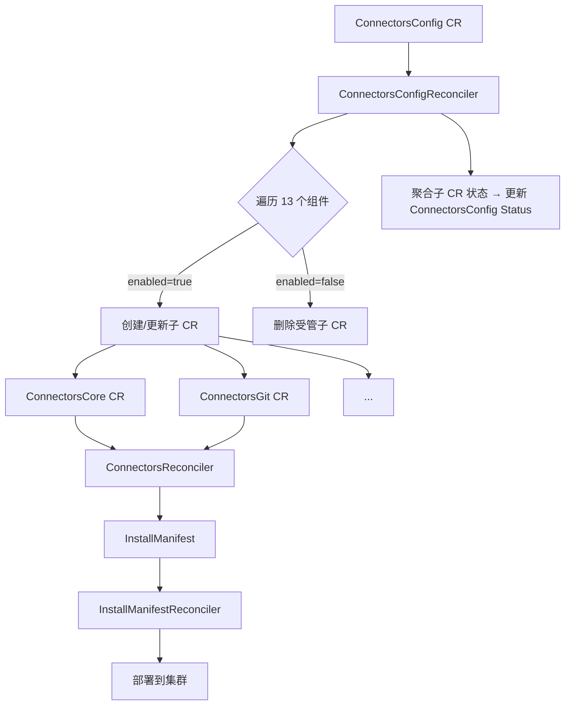
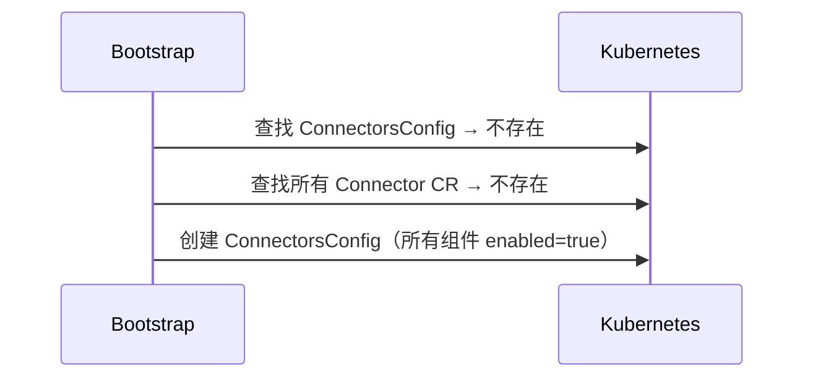
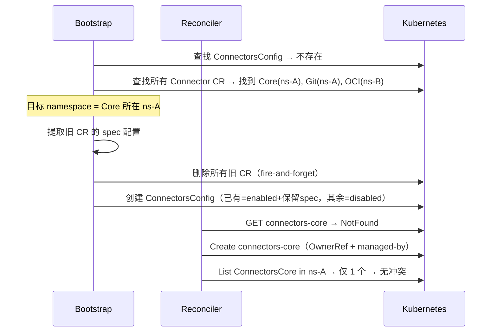

# ConnectorsConfig 设计文档

> DEVOPS-42744: Connectors-Operator 支持通过一个 CR 来进行安装

## 1. 概述

### 1.1 目标

提供 `ConnectorsConfig` 资源，通过单一 CR 完成所有 Connectors 组件的安装和配置，简化用户操作。

### 1.2 验收标准

1. 安装完 Connectors-Operator 后，自动完成所有内置组件的安装
2. 提供各组件是否安装以及配置的能力，用户可按需关闭/启用组件
3. 移除 OperatorHub 中 ConnectorClass 和 Connector 的资源创建入口

### 1.3 设计决策

| 决策 | 选择 | 原因 |
|------|------|------|
| CR 命名 | ConnectorsConfig | 与 ConnectorsCore/ConnectorsGit 命名风格一致 |
| 默认启用 | 全部 13 个组件 | 开箱即用，用户按需关闭 |
| Harbor Tekton | 不纳入管理 | 独立附加组件，后续按需扩展 |
| 迁移策略 | Bootstrap 删除旧 CR + 创建 ConnectorsConfig | Bootstrap fire-and-forget 删除旧 CR，Reconciler 检测冲突并报告 |
| 自动创建控制 | ConfigMap 开关 + Bootstrap | 类似 Tekton，可通过 ConfigMap 或 Operator Deployment 控制 |
| ComponentSpec 拆分 | 提取 ComponentCommonSpec | 将可全局化字段（Registry/Labels/Annotations）拆为独立类型 |
| 组件配置复用 | map\[string\]ComponentConfig + JSON | 新增组件只需添加 registry 条目 + Spec/CR 类型，不改 ConnectorsConfigSpec |
| 组件扩展性 | CR 接口化 Component Registry | 复用已有 BaseComponent 接口，Spec 类型零新增方法，Webhook 通过注册的校验弥补 CRD schema |
| 组件状态 | Phase + ComponentReference | 去掉冗余的 Enabled/Ready，CRName 升级为含 GVK/NS 的 ObjectRef |

## 2. CRD 设计

### 2.1 ConnectorsConfig

```yaml
apiVersion: operator.connectors.alauda.io/v1alpha1
kind: ConnectorsConfig
metadata:
  name: connectors
  namespace: cpaas-system
spec:
  global:
    # ComponentCommonSpec — 可全局化字段，各组件可覆盖
    registry: "registry.example.com"
    labels:
      env: production
    annotations: {}
  components:
    core:
      enabled: true  # 默认 true，Core 不允许设为 false（Required）
      spec:
        featureFlags:
          enable-proxy: "true"
    git: {}           # enabled 默认 true，使用 global 配置
    github: {}
    gitlab: {}
    oci:
      enabled: true
      spec:
        expose:
          type: Ingress
          domain: oci.example.com
          ingress:
            ingressClassName: nginx
    k8s: {}
    maven: {}
    npm: {}
    pypi: {}
    harbor:
      enabled: true
      spec:
        expose:
          type: NodePort
          nodePort:
            port: 30080
        workloads:
          - name: harbor-connector
            replicas: 2
    sonarqube:
      enabled: false  # 用户选择不安装
    nexus:
      enabled: false
    jfrog:
      enabled: false
status:
  conditions:
    - type: Ready
      status: "True"
      reason: AllReady
    - type: Migrated
      status: "True"
      reason: NonMigration
    - type: ComponentsReady
      status: "True"
      reason: AllReady
      message: "10/10 components ready (3 disabled)"
  components:
    core:
      phase: Ready
      reference:
        apiVersion: operator.connectors.alauda.io/v1alpha1
        kind: ConnectorsCore
        name: connectors-core
        namespace: cpaas-system
    sonarqube:
      phase: Disabled
      message: "Component disabled by user"
```

### 2.2 ComponentSpec 拆分

将现有 `component.ComponentSpec` 按字段语义拆分为两层：

```go
// pkg/apis/v1alpha1/component/component_types.go

// ComponentCommonSpec — 可跨组件通用化的配置字段
type ComponentCommonSpec struct {
    Labels      map[string]string `json:"labels,omitempty"`
    Annotations map[string]string `json:"annotations,omitempty"`
    Registry    string            `json:"registry,omitempty"`
}

// ComponentSpec — 组件完整配置（嵌入 CommonSpec + 组件级字段）
type ComponentSpec struct {
    ComponentCommonSpec `json:",inline"`
    Workloads           []WorkloadOverride `json:"workloads,omitempty"`
    AdditionalManifests string             `json:"additionalManifests,omitempty"`
}
```

**拆分依据**：Registry/Labels/Annotations 适用于所有组件，可统一设置；Workloads 按 deployment name 匹配、AdditionalManifests 指向组件特定清单，跨组件无意义。`ComponentSpec` 通过 inline 嵌入 `ComponentCommonSpec`，JSON 序列化不变，现有使用方无感知。

### 2.3 类型定义

`ConnectorsConfigSpec` 使用 `map[string]ComponentConfig` 存储组件配置，组件 Spec 以 JSON 存储。
新增组件只需：添加 Spec 类型 + 在 componentRegistry 注册条目。

```go
// pkg/apis/v1alpha1/connectorsconfig_types.go

type ConnectorsConfigSpec struct {
    // ComponentCommonSpec 直接 inline（labels / annotations / registry /
    // installFlags）作为集群级默认值，按字段下发到每个受管子 CR。
    // 历史版本曾用过 `spec.global.*` 嵌套包装；DEVOPS-43943 (62caab0)
    // 改为 inline 嵌入以与 per-component CR 的 spec 形态一致。
    component.ComponentCommonSpec `json:",inline"`
    Components map[string]ComponentConfig    `json:"components,omitempty"`
}

type ComponentConfig struct {
    Enabled *bool                    `json:"enabled,omitempty"`
    Spec    *apiextensionsv1.JSON    `json:"spec,omitempty"` // 组件特有配置（JSON）
}

// Enabled 为 *bool，nil 视为 true（默认启用）。
// Spec 为 JSON，由 Webhook 通过 registry 反序列化到 CR 类型后校验。
// 组件特有字段（FeatureFlags, Expose）在各自 Spec 类型中定义，通过 CR 接口化 registry 解耦。

// --- Status ---

type ConnectorsConfigStatus struct {
    duckv1.Status `json:",inline"`
    // MigratedFrom records the migration source when upgrading from standalone CRs.
    MigratedFrom *MigrationRecord                  `json:"migratedFrom,omitempty"`
    Components   map[string]ComponentInstallStatus  `json:"components,omitempty"`
}

type MigrationRecord struct {
    Timestamp  metav1.Time         `json:"timestamp"`
    Components []MigratedComponent `json:"components,omitempty"`
}

type MigratedComponent struct {
    Name              string `json:"name"`
    OriginalName      string `json:"originalName"`
    OriginalNamespace string `json:"originalNamespace"`
}

type ComponentInstallStatus struct {
    Phase     ComponentPhase      `json:"phase"`
    Message   string              `json:"message,omitempty"`
    Reference *corev1.ObjectReference `json:"reference,omitempty"` // nil when disabled
}

type ComponentPhase string

const (
    ComponentPhasePending  ComponentPhase = "Pending"
    ComponentPhaseCreating ComponentPhase = "Creating"
    ComponentPhaseReady    ComponentPhase = "Ready"
    ComponentPhaseUpdating ComponentPhase = "Updating"
    ComponentPhaseDeleting ComponentPhase = "Deleting"
    ComponentPhaseDisabled ComponentPhase = "Disabled"
    ComponentPhaseFailed   ComponentPhase = "Failed"
)
```

### 2.4 CR 接口化组件注册表

采用 **Component Registry** 模式，完全复用已有 `BaseComponent` 接口，Spec 类型零新增方法。注册表与接口定义同处 `pkg/apis/v1alpha1/component/` 包：

```go
// pkg/apis/v1alpha1/component/component_registry.go

// ComponentDefinition — 组件注册表条目。NewComponent 返回已有的 BaseComponent，
// 无需在 Spec 上新增任何方法。
type ComponentDefinition struct {
    Name         string                          // 组件标识（如 "core"、"git"）
    CRName       string                          // 确定性子 CR 名（如 "connectors-core"）
    GVK          schema.GroupVersionKind         // 子 CR 的 GroupVersionKind
    NewComponent func() BaseComponent            // 创建零值 CR，用于反序列化 / 调用接口方法
    Required     bool                            // true = 不可禁用（仅 core）
}

// 包级注册表（map），由各组件在自身 init() 中填充。
var components = make(map[string]ComponentDefinition)

// RegisterComponent 将组件注册到全局表，重复注册直接 panic
// （fail-fast：进程启动期发现，避免运行时静默冲突）。
func RegisterComponent(def ComponentDefinition) {
    if _, exists := components[def.Name]; exists {
        panic(fmt.Sprintf("duplicate component registration: %s", def.Name))
    }
    components[def.Name] = def
}

// Components 返回按 Name 排序后的所有注册条目
// （排序保证 reconcile / webhook / bootstrap 遍历顺序确定）。
func Components() []ComponentDefinition {
    names := make([]string, 0, len(components))
    for name := range components {
        names = append(names, name)
    }
    sort.Strings(names)
    defs := make([]ComponentDefinition, 0, len(names))
    for _, name := range names {
        defs = append(defs, components[name])
    }
    return defs
}

// GetComponent 按名查找，未注册返回 nil（webhook 用来识别未知组件名）。
func GetComponent(name string) *ComponentDefinition {
    def, ok := components[name]
    if !ok {
        return nil
    }
    return &def
}
```

**注册时机**：与 `SchemeBuilder.Register` 同位置——每个 `connectors<X>_types.go` 的 `init()` 中直接调用 `component.RegisterComponent`。这样新增/移除 CR 类型的全部影响都集中在该文件，类型与注册不会失同步。

```go
// pkg/apis/v1alpha1/connectorscore_types.go
func init() {
    SchemeBuilder.Register(&ConnectorsCore{}, &ConnectorsCoreList{})
    component.RegisterComponent(component.ComponentDefinition{
        Name:         "core",
        CRName:       "connectors-core",
        GVK:          ConnectorsCoreGVK,
        NewComponent: func() component.BaseComponent { return &ConnectorsCore{} },
        Required:     true,
    })
}

// pkg/apis/v1alpha1/connectorsgit_types.go（无 Required，默认 false）
func init() {
    SchemeBuilder.Register(&ConnectorsGit{}, &ConnectorsGitList{})
    component.RegisterComponent(component.ComponentDefinition{
        Name:         "git",
        CRName:       "connectors-git",
        GVK:          ConnectorsGitGVK,
        NewComponent: func() component.BaseComponent { return &ConnectorsGit{} },
    })
}
```

**可选接口**（定义在 `pkg/apis/v1alpha1/component/component_interfaces.go`，仅有组件特有校验/默认值需求时在 CR 上实现）：

```go
// Validator — 组件 CR 在通用 ComponentSpec 之外提供额外校验。
type Validator interface {
    ValidateComponent(ctx context.Context, fldPath *field.Path) field.ErrorList
}

// Defaulter — 组件 CR 提供自身 spec 的默认值。
type Defaulter interface {
    DefaultComponent()
}
```

目前仅 `ConnectorsCore` 实现这两个接口（用于 `FeatureFlags` 的校验与默认填充）。其余组件无任何 spec 特殊字段，无需实现。

**复用已有接口**（Spec 类型无需新增任何方法）：

| 能力 | 来源 | 是否新增 |
|------|------|---------|
| `ComponentSpec()` | `BaseComponent` 接口 | 已有 |
| `DeepCopyObject()` | `client.Object` 接口 | 已有 |
| `ValidateComponent()` | CR 上的 `component.Validator`（可选） | 仅 Core 实现 |
| `DefaultComponent()` | CR 上的 `component.Defaulter`（可选） | 仅 Core 实现 |

新增组件只需：

1. 创建 `Connectors<X>Spec` 类型（嵌入 `component.ComponentSpec`）+ CR 类型（实现 `BaseComponent`）
2. 在该文件 `init()` 中追加 `component.RegisterComponent(...)`（~6 行）

`resolveComponents()`、controller Watch 注册、Webhook 校验/默认值、Bootstrap 扫描等逻辑均由 `component.Components()` 驱动遍历，无需逐一修改。

### 2.5 Conditions 设计

三个 Condition 维度：

| Condition | 含义 | Ready 前提 |
|-----------|------|-----------|
| `Ready` | 整体就绪 | 所有其他 Conditions 为 True |
| `Migrated` | 旧数据迁移完成 | 全新安装直接 True；升级迁移完成后 True |
| `ComponentsReady` | 所有启用组件就绪 | 所有 enabled 组件 phase=Ready |

```go
// pkg/apis/v1alpha1/connectorsconfig_lifecycle.go

const (
    ConditionMigrated        apis.ConditionType = "Migrated"
    ConditionComponentsReady apis.ConditionType = "ComponentsReady"
)

var connectorsConfigCondSet = apis.NewLivingConditionSet(ConditionMigrated, ConditionComponentsReady)
```

Lifecycle 方法定义在 `ConnectorsConfigStatus` 上，遵循 connectors 仓库的 `*_lifecycle.go` 模式：

```go
func (s *ConnectorsConfigStatus) GetConditionSet() apis.ConditionSet
func (s *ConnectorsConfigStatus) InitializeConditions()
func (s *ConnectorsConfigStatus) IsReady() bool
func (s *ConnectorsConfigStatus) GetCondition(t apis.ConditionType) *apis.Condition
func (s *ConnectorsConfigStatus) MarkNonMigration()
func (s *ConnectorsConfigStatus) MarkMigrationCompleted(count int)
func (s *ConnectorsConfigStatus) MarkComponentsReady(ready, enabled, disabled int)
func (s *ConnectorsConfigStatus) MarkComponentsFailed(failed int, failedNames []string)
func (s *ConnectorsConfigStatus) MarkComponentsProgressing(ready, enabled, disabled int)
```

#### Reason 枚举

```go
const (
    ReasonNonMigration          = "NonMigration"
    ReasonMigrationCompleted    = "MigrationCompleted"
    ReasonComponentsProgressing = "ComponentsProgressing"
    ReasonAllReady              = "AllReady"
    ReasonComponentFailed       = "ComponentFailed"
)
```

#### 典型场景状态

**全新安装（终态）：**

```yaml
conditions:
  - { type: Ready,           status: "True",  reason: AllReady }
  - { type: Migrated,        status: "True",  reason: NonMigration }
  - { type: ComponentsReady, status: "True",  reason: AllReady, message: "13/13 components ready" }
```

**升级迁移（冲突中）：** Bootstrap 已 fire-and-forget 删除旧 CR，但尚未删除完成，Reconciler 检测到同 GVK 多实例。

```yaml
conditions:
  - { type: Ready,           status: "False", reason: ComponentFailed }
  - { type: Migrated,        status: "True",  reason: MigrationCompleted }
  - { type: ComponentsReady, status: "False", reason: ComponentFailed, message: "1 component(s) failed: [core]" }
components:
  core: { phase: Failed, message: "conflicting ConnectorsCore CR(s) found: [my-core]" }
# 旧 CR 删除完成后，下次 reconcile 冲突消失，自动恢复 Ready
```

**组件禁用：** 禁用的组件不影响 Ready。

```yaml
conditions:
  - { type: Ready,           status: "True",  reason: AllReady }
  - { type: ComponentsReady, status: "True",  reason: AllReady, message: "10/10 components ready (3 disabled)" }
components:
  sonarqube: { phase: Disabled, message: "Component disabled by user" }
```

#### `kubectl get` 输出

```
NAME         READY   REASON                  AGE
connectors   True    AllReady                5m
connectors   False   ComponentsProgressing   1m
connectors   False   ComponentNotReady       10m
```

### 2.6 子组件 Phase 判定

通过读取子 CR 的 Conditions 确定 Phase。子 CR 有三个 Condition：`TransformReady`、`InstallerSetAvailable`、`InstallerSetReady`。

`InstallerSetReady=False` 时通过 Reason 区分"进行中"与"失败"：

| Reason | 映射 Phase |
|--------|-----------|
| `InstallerInstalling` | Creating |
| `InstallerUpgrading` / `InstallerReinstalling` | Updating |
| `InstallerInternalError` | Failed |

```go
func determinePhase(childCR) ComponentPhase {
    if childCR == nil { return ComponentPhasePending }

    if conditionIsTrue(conditions, "Ready") { return ComponentPhaseReady }
    if conditionIsFalse(conditions, "TransformReady") { return ComponentPhaseFailed }

    if inst := getCondition(conditions, "InstallerSetReady"); inst != nil && inst.IsFalse() {
        switch inst.Reason {
        case "InstallerInstalling":                      return ComponentPhaseCreating
        case "InstallerUpgrading", "InstallerReinstalling": return ComponentPhaseUpdating
        case "InstallerInternalError":                   return ComponentPhaseFailed
        }
    }
    return ComponentPhaseCreating // Conditions 尚未初始化
}
```

## 3. 控制器设计

### 3.1 架构



### 3.2 Reconcile 流程

```
1. 获取 ConnectorsConfig CR
2. 管理 Finalizer
3. 遍历 13 个组件:
   a. enabled=true:
      - 按确定性名称查找子 CR → 不存在则创建（OwnerRef + cpaas.io/managed-by 标签），已存在则同步 spec
      - List 同 GVK 同 namespace → 发现非受管 CR → 报告 Failed（冲突）
   b. enabled=false:
      - 查找并删除受管子 CR（如存在）
4. 聚合子 CR 状态 → 更新 ConnectorsConfig status
5. 有组件未 Ready → Requeue (30s)
```

### 3.3 子 CR 管理

**命名规则**：`connectors-<type>`（如 `connectors-core`、`connectors-git`）。

**标签**：
- `cpaas.io/managed-by: connectorsconfig`（复用 `v1alpha1.ManagedByKey`，值为 controller 私有常量）

**OwnerReference**：ConnectorsConfig 为 owner，`controller: false`（子 CR 的 controller 是 ConnectorsReconciler），确保级联删除。

**Spec 合并规则**（集群级 inline ComponentCommonSpec 与 per-component）：

| 字段 | 合并规则 |
|------|---------|
| Registry | per-component 非空则用，否则用集群级 |
| Labels / Annotations | 集群级与 per-component 合并，冲突时 per-component 优先 |
| InstallFlags | 集群级与 per-component 按 key 合并，冲突时 per-component 优先 |
| Workloads / AdditionalManifests | 仅组件级，不参与集群级合并 |
| FeatureFlags / Expose | 仅特定组件，不参与集群级合并 |

**Spec 漂移**：用户手动修改受管子 CR，下次 reconcile 覆盖回 ConnectorsConfig 配置，通过 Event 通知。

**冲突检测**：Reconciler 不会自动删除非受管 CR。同 namespace 存在同 GVK 的其他 CR 时标记 Failed，message 列出冲突 CR 名称。用户手动删除后自动恢复。

**Adoption 策略**：Reconciler 不会自动 adopt 已存在但缺少 `cpaas.io/managed-by` 标签的子 CR。如果 Bootstrap 删除旧 CR 失败（如 finalizer 阻塞），Reconciler 会报告 Failed 并提示用户手动删除冲突 CR。这是有意的 fail-fast 设计——避免静默 adopt 可能导致的配置不一致。旧 CR 的 finalizer 完成删除后，Reconciler 会在下次 reconcile 自动创建新的受管子 CR。

### 3.4 Watch 设置

由 registry 驱动，自动为所有注册组件设置 Watch，新增组件无需修改：

```go
func (r *ConnectorsConfigReconciler) SetupWithManager(mgr ctrl.Manager) error {
    entries := resolveComponents(&v1alpha1.ConnectorsConfigSpec{})

    b := ctrl.NewControllerManagedBy(mgr).
        For(&v1alpha1.ConnectorsConfig{}, builder.WithPredicates(predicate.Or[client.Object](
            predicate.GenerationChangedPredicate{},
            predicate.AnnotationChangedPredicate{},
            predicate.LabelChangedPredicate{},
        )))

    for _, entry := range entries {
        obj := &unstructured.Unstructured{}
        obj.SetGroupVersionKind(entry.GVK)
        b = b.Watches(obj, handler.EnqueueRequestsFromMapFunc(childCREnqueueFunc()))
    }
    return b.Complete(r)
}
```

## 4. Bootstrap 与迁移

### 4.1 自动创建控制

通过 operator-config ConfigMap 控制是否自动创建 ConnectorsConfig。ConfigMap 名称由 Operator Deployment 环境变量 `CONFIG_NAME` 指定，所在 namespace 由 `SYSTEM_NAMESPACE` 环境变量指定：

```yaml
# operator-config ConfigMap
kind: ConfigMap
metadata:
  name: <CONFIG_NAME>           # 由 Operator Deployment 环境变量 CONFIG_NAME 指定
  namespace: <SYSTEM_NAMESPACE> # 由 Operator Deployment 环境变量 SYSTEM_NAMESPACE 指定
data:
  autoinstall-components: "true"           # 设为 "false" 禁止自动创建
```

### 4.2 Namespace 确定

| 优先级 | 来源 |
|--------|------|
| 1 | 已有 ConnectorsCore CR 所在 namespace（升级迁移场景） |
| 2 | `SYSTEM_NAMESPACE` 环境变量（Kubernetes Downward API，Operator 所在 namespace） |

### 4.3 三种场景

#### 场景 A：全新安装



#### 场景 B：旧版升级（已有独立 CR）

**策略**：Bootstrap fire-and-forget 删除旧 CR → 创建 ConnectorsConfig → Reconciler 创建受管子 CR + 检测冲突。



若旧 CR 尚未删除完成，Reconciler 会检测到同 GVK 多实例并报告冲突（Failed），旧 CR 删除完成后自动恢复。

#### 场景 C：ConnectorsConfig 已存在

Bootstrap 直接跳过。

### 4.4 实现

```go
type ConnectorsConfigBootstrap struct {
    client.Client
    Log *zap.SugaredLogger
}

func (b *ConnectorsConfigBootstrap) Start(ctx context.Context) error {
    // 1. 等待 cache 同步（轮询 500ms，超时 30s）
    // 2. operator-config ConfigMap autoinstall-components=false → 跳过
    // 3. ConnectorsConfig 已存在 → 跳过
    // 4. 扫描所有注册组件 CR（通过 component registry 驱动）
    // 5. 确定目标 namespace（有旧 Core → 用其 ns，否则用 SYSTEM_NAMESPACE）
    // 6. 升级场景：提取旧 CR spec → fire-and-forget 删除旧 CR → 更新 migration status
    // 7. 构建并创建 ConnectorsConfig（指数退避重试，等待 webhook 可达）
}

func (b *ConnectorsConfigBootstrap) NeedLeaderElection() bool { return true }
```

**重试策略**：`createRetryBackoff` 使用指数退避，Steps=10、初始延迟=2s、因子=1.5，最大累计等待约 114s，吸收 webhook 网络层面的收敛延迟。

**职责边界**：
- **Bootstrap**：确保 ConnectorsConfig 存在 + fire-and-forget 删除旧 CR
- **Reconciler**：管理子 CR 生命周期 + 检测冲突并报告

注册方式：在 `ConnectorsConfigReconciler.Setup()` 中通过 `mgr.Add()` 注册。

### 4.5 Bootstrap 启动时序与 Webhook 就绪分析

#### controller-runtime 启动顺序

`manager.Start()` 内部严格串行执行以下步骤（每步 `Start()` 会阻塞直到该组所有 Runnable 就绪）：

```
1. HTTPServers.Start()   → health probe (/readyz) 开始服务
                           ★ Pod 可能在此时就被 Kubernetes 标记为 Ready ★
                           （我们使用 healthz.Ping，直接返回 200，无额外门槛）
2. Webhooks.Start()      → webhook HTTP server 真正 Listen 成功（:9443）
3. Caches.Start()        → informer cache sync 完成
4. Others.Start()        → NeedLeaderElection=false 的 Runnable 启动
5. leaderElector.Run()   → 后台 goroutine 竞争 leader
   └─ OnStartedLeading() → startLeaderElectionRunnables()
                           ★ ConnectorsConfigBootstrap.Start() 在此执行 ★
```

#### 关键结论

- **Webhook 进程模型**：与 Tekton Operator（webhook 独立 Pod）不同，我们的 webhook 与 operator 在同一进程内，由 `manager.Start()` 在步骤 2 启动。
- **Bootstrap 运行时 webhook 已就绪**：Bootstrap 运行于步骤 5，此时 webhook HTTP server 已监听（步骤 2）且 cache 已同步（步骤 3）。
- **Pod Ready 早于 Bootstrap**：由于 `/readyz` 使用 `healthz.Ping`（始终返回 200），Pod 在步骤 1 后即可被标记为 Ready，早于 Bootstrap 运行。因此 Bootstrap 运行时 Service endpoints 通常已收敛。
- **`createRetryBackoff` 的必要性**：主要覆盖以下边缘场景：
  - 首次部署时，kubelet readiness 探测间隔（默认 10s）+ endpoint controller 收敛有延迟窗口
  - cert-manager 首次将 `caBundle` 注入 `MutatingWebhookConfiguration` 需要时间
  - 多副本 rollout 时，旧 Pod 退出与新 Pod endpoints 收敛存在短暂窗口

#### 与 Tekton Operator 的对比

| 维度 | ConnectorsConfig（本项目） | Tekton Operator |
|------|--------------------------|-----------------|
| Webhook 进程 | 与 operator 同进程 | 独立 Pod（彻底规避鸡蛋问题） |
| Bootstrap 触发 | `manager.Runnable`（`NeedLeaderElection=true`） | controller 构造函数内同步调用 `ensureInstance()` |
| Cache 等待 | 手动 `waitForCacheSync` 轮询（500ms/30s） | knative sharedmain 保证构造函数调用时 cache 已就绪 |
| Webhook 等待 | 指数退避重试（~114s 上限） | 无需等待（独立进程早已就绪）；`PollUntilContextTimeout` 间隔 10s/超时 5min |
| 失败处理 | 返回 error（bootstrap 失败，operator 退出） | 超时后打日志继续运行，提示用户手动创建 |

### 4.6 迁移风险与缓解

| 风险 | 缓解 |
|------|------|
| 删除旧 CR 到新 CR 就绪间有短暂服务中断 | 在维护窗口执行升级；文档说明影响 |
| 旧 CR 未删完时 Reconciler 已创建新 CR | 冲突检测报告 Failed，旧 CR 删完后自动恢复 |
| 配置提取遗漏 | 每种组件使用专用提取函数，确保特有字段不遗漏 |
| 部分旧 CR 删除失败 | Bootstrap 记录日志并继续；残留 CR 由 Reconciler 冲突检测发现 |

## 5. Webhook 设计

### 5.1 Defaulter

遍历 `component.Components()`，反序列化 JSON 到 CR，调用 `component.Defaulter`（如有），序列化回 JSON：

```go
func (c *ConnectorsConfig) Default(ctx context.Context) {
    for _, def := range component.Components() {
        cr := def.NewComponent()
        // 反序列化 spec JSON 到 CR
        // 调用 cr.(component.Defaulter).DefaultComponent()（如有，目前仅 ConnectorsCore）
        // 序列化回 ComponentConfig.Spec
    }
}
```

### 5.2 Validator

遍历 `component.Components()`，反序列化 JSON 到 CR，调用 `ComponentSpec.Validate()` + `component.Validator.ValidateComponent()`（如有）：

- **ValidateCreate**：单例校验 + 未知组件名拒绝 + Required 组件不可 disable + 各组件 Spec 校验
- **ValidateUpdate**：Required 组件不可 disable + 各组件 Spec 校验
- **ValidateDelete**：无特殊校验

## 6. CSV / OperatorHub 变更

修改 `config/manifests/bases/connectors-operator.clusterserviceversion.yaml`：

1. **添加** ConnectorsConfig 到 owned CRDs
2. **移除** ConnectorClass 和 Connector 的 OperatorHub 创建入口
3. **更新** `operators.operatorframework.io/disable-create-objects` 注解

## 7. 测试策略

### 7.1 单元测试

| 文件 | 覆盖范围 |
|------|---------|
| `connectorsconfig_func_test.go` | IsComponentEnabled, GetMergedComponentSpec, ListComponents |
| `connectorsconfig_controller_test.go` | 子 CR 创建/更新/删除、状态聚合、spec 漂移修复 |
| `connectorsconfig_bootstrap_test.go` | 全新安装、旧 CR 采纳、已有 Config 跳过 |

### 7.2 E2E 测试

**全新安装**：创建 ConnectorsConfig → 13 个子 CR Ready → 禁用/启用组件 → global.registry 传播 → 级联删除

**冲突检测**：创建独立 CR → 创建 ConnectorsConfig → 验证 Failed + conflicting message → 删除独立 CR → 恢复 Ready

**升级迁移**：预创建旧 CR → 重启 operator → Bootstrap 删除旧 CR 并创建 ConnectorsConfig → 子 CR 重建 → 配置一致；部分安装；跨 namespace；AUTOINSTALL_COMPONENTS=false

## 8. 文件变更清单

| 文件 | 操作 |
|------|------|
| `pkg/apis/v1alpha1/component/component_types.go` | 修改（拆分 ComponentCommonSpec） |
| `pkg/apis/v1alpha1/component/component_interfaces.go` | 修改（新增 `Validator` / `Defaulter` 可选接口） |
| `pkg/apis/v1alpha1/component/component_registry.go` | 新建（`ComponentDefinition` + `RegisterComponent`/`Components`/`GetComponent`） |
| `pkg/apis/v1alpha1/connectors<X>_types.go` | 修改（每个 CR 在 `init()` 中调用 `component.RegisterComponent`） |
| `pkg/apis/v1alpha1/connectorscore_webhook.go` | 修改（实现 `component.Validator` / `component.Defaulter`） |
| `pkg/apis/v1alpha1/connectorsconfig_types.go` | 新建 |
| `pkg/apis/v1alpha1/connectorsconfig_lifecycle.go` | 新建（Condition 定义 + LivingConditionSet + lifecycle 方法） |
| `pkg/apis/v1alpha1/connectorsconfig_func.go` | 新建 |
| `pkg/apis/v1alpha1/connectorsconfig_webhook.go` | 新建 |
| `pkg/controllers/connectorsconfig_controller.go` | 新建 |
| `pkg/controllers/connectorsconfig_resolve.go` | 新建（resolveComponents + resolvedComponent） |
| `pkg/controllers/connectorsconfig_bootstrap.go` | 新建 |
| `cmd/main.go` | 修改 |
| `config/manifests/bases/connectors-operator.clusterserviceversion.yaml` | 修改 |
| `config/samples/operator_connectors_v1alpha1_connectorsconfig.yaml` | 新建 |
| `testing/features/deploy-connectors-config.feature` | 新建 |
| `testing/features/upgrade-to-connectors-config.feature` | 新建 |
