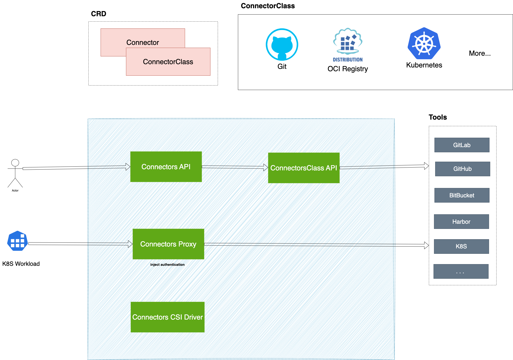

# Alauda Connectors 产品定位

> 基于 connectors-operator `docs/en/` 提炼。**目标**:让完全没接触过 Connectors 的读者 2 分钟内理解产品定位。

## 0. 立项原始动机

Connectors 当初立项,是为了解决上一代 **DevOps v3 集成方案**的两个核心痛点:

1. **DevOps v3 凭据泄露**:
    - v3 集成方案会把凭据**同步到业务 namespace** 中,凭据散落在各业务 NS 的 Secret 里,存在泄露风险。
2. **集成新类型工具存在成本**:
    - v3 集成方案与具体工具**紧密耦合**, 每接入一种新类型工具都要定制开发, 存在不小成本。

## 1. 是什么

Connectors 把"**集群内统一接入外部工具 + 客户端以 Secretless 方式的使用**"作为单一关注点。让平台租户、工作负载、CI 任务在使用外部工具(Git 仓库、镜像仓库、K8s 集群、制品库 ...)时,**不需要分发或持有原始凭据**。

**回应 v3 Integration**:

- **统一接入**: 按协议，可扩展的 ConnectorClass/Proxy 抽象(解决**定制成本**)。
- **安全使用**: 凭据只留在控制面 + data-plane proxy 让客户端 secretless 使用(解决**泄露**);

**一句话总结**:

> **Connectors = 让外部各类型工具，在 K8s 集群里 " 以 Secretless 的方式使用, 原始凭据不被分发" 的 统一 接入层。**

更多细节

## 架构图

> 完整架构说明见 `docs/en/connectors/architecture/index.mdx`。

## 2. 解决什么问题

在没有 Connectors 的世界,**每个团队各自处理工具接入这件事**,代价是:

- 凭据散落在 Secret + envFrom + shell 脚本里,容易漏进 commit log / pipeline log / 环境变量
- 不同工具(Git / Harbor / kubeconfig / Maven settings)凭据格式各异,每个团队重写一遍
- 凭据轮换时几十条 pipeline 同时红,没人知道该改哪份 Secret
- 平台 UI 要列"用户可访问的 Git repo / 镜像 tag",得为每个工具单独写一份 API client + 权限模型

Connectors 把这些统一收编 —— 平台/项目管理员一次性建好工具接入对象;CI 任务/业务负载拿到的是渲染好的配置文件,指向集群内的认证代理;**原始凭据从此只在控制面流动,业务进程永不接触**。

## 3. 不是什么(与相邻能力的边界)

| 类别 | 例子 | 关注点 | 与 Connectors 的差异 |
|------|------|--------|---------------------|
| 秘密管理 | Vault、External Secrets Operator | 通用 secret 存储 / 动态凭据 / 加密 | Connectors **不存** secret,引用的还是 K8s Secret;Vault 可作 backend |
| API 网关 | Kong、APISIX、Istio Gateway | 通用 HTTP/gRPC 流量入口 | Connectors 只代理"外部工具"协议,不是通用网关 |
| CSI Secret Store | secrets-store-csi-driver | 把外部 secret 系统的**明文密钥**挂进 Pod | Connectors CSI 挂的是**渲染后的工具配置**(如 `.gitconfig` + 代理地址 + 短期 token),不挂原始凭据 |
| 策略校验 | OPA / Gatekeeper | 通用 K8s 资源策略 DSL | Connectors 的 AccessPolicy 只管"运行时使用 Connector 时要不要先审批" |
| Operator 上架 | OperatorHub / OLM | 通用 Operator 生命周期 | connectors-operator 自身**由 OLM 管**,Connectors 解决的是 OLM 之上的工具接入问题 |
| CI/CD 平台 | Tekton、Argo、Jenkins | 流水线调度引擎 | Connectors 是**被 Pipeline 消费的资源**,不调度 Pipeline 本身 |
| 镜像/制品仓库 | Harbor、Nexus、Artifactory | 制品存储 | Connectors 把它们包成 secretless 入口,不取代存储 |
| 身份系统 | ACP IAM、Keycloak、Dex | 用户身份与 SSO | Connectors 复用 K8s RBAC,不发身份、不管用户目录 |

## 4. 核心价值

- **Connectors 不替代 Secret 管理**,它是 Secret 的**消费层** —— 已有的 Vault / K8s Secret 仍是凭据来源,Connectors 只把它们安全地"用出去"
- **Connectors 不是工具本身**,只关心**统一接入与使用** —— Git / Harbor / K8s 仍在原处,Connectors 让它们在集群内一致呈现
- **接入即工具能力开放**:10+ 内置工具类型,统一以"建模 + 鉴权 + 资源浏览 + secretless 调用"四个面打开;新接一个工具是写一份 ConnectorClass YAML,不是写一套消费胶水

---

了解更多机制和使用场景

## 了解更多机制和使用场景

> 想进一步理解 Connectors 怎么实现"是什么/解决什么"的读者读这里。术语首次出现处带 1 句解释,完整概念文档见 `docs/en/connectors/concepts/`。

**核心抽象**

| 抽象 | 角色 |
|------|------|
| **ConnectorClass**(集群级) | 声明一类工具的接入契约 —— 地址形态、认证方式、可达性/鉴权探活、是否带 API 透传、是否带 Proxy、CSI 渲染模板。新接一种工具 = 新写一份 ConnectorClass |
| **Connector**(命名空间级,带集群/项目/命名空间三层 scope) | 一个具体工具实例 —— 地址 + 引用一个 K8s Secret 作为凭据来源。系统按 ConnectorClass 自动算出对外的 Proxy 地址与 API 路径 |
| **ResourceInterface**(集群级) | 标准化"可被 Pipeline 选择的资源类型"(如 Git 仓库、OCI 制品、Maven 包),让 Pipeline 编辑器统一展示与选择,而不是硬编码 URL |
| **AccessPolicy / AccessRequest**(命名空间级) | 在 Proxy 之上叠加门控。AccessPolicy 是长期规则(谁要先审批才能用);AccessRequest 是一次运行时使用尝试 + 审批结果 |

**统一接入建模 + 类型扩展**

Connectors 的关键设计是把"接入一种工具"做成可扩展点 —— 内置 10+ ConnectorClass 覆盖常见工具(Git / GitLab / GitHub / Harbor / OCI / Maven / NPM / PyPI / SonarQube / K8s),客户若要接入企业自研工具或非标外部系统,**写一份 ConnectorClass YAML 即可**(含可选的 Rego 自定义认证逻辑),无需改 Connectors 源码或写新的消费胶水。每个工具一旦建模为 Connector,平台、UI、CI 任务、工作负载就用同一套方式访问它。

**运行时:控制面 + 三条数据面通道**

控制面由 operator + 各 controller 构成,负责 reconcile 资源、跑可达性/鉴权探活、生成审批结果。数据面由三条通道并行承载工具访问:

- **Proxy** —— 协议代理。客户端用 K8s 短期 SA token 鉴权,Proxy 在后端注入真凭据。HTTP 工具走内置正/反向代理,OCI / Harbor 等带自定义代理
- **CSI Driver** —— 配置文件挂载。把 ConnectorClass 渲染模板 + 短期 token + Proxy 地址挂进 Pod 指定路径,业务进程当普通配置读
- **Connectors API** —— 统一资源浏览。让 UI 列出"用户可访问的 Git 分支 / 镜像 tag / 项目仓库",平台不必为每个工具单独写 API client

真凭据的流动范围只有两处:controller 读 K8s Secret + Proxy 注入后端请求,**永不到达业务进程**。

---

## 竞品与同类产品

Connectors 不是 secrets vault,而是"协议感知的数据面代理 + K8s 短期工作负载身份,嵌入 CI/CD 的连接(Connection)抽象"。按"与 Connectors 像在哪"把社区产品分为三个同心环,**越靠内越像 Connectors、越有定位参考价值**。下面每个环一张表 + 一段描述。

**总览**:第 ③ 环是"可作为 Connectors 后端凭据来源 / 部分功能重合"的**存储层**; 第 ①、② 环才是**产品定位上真正对标**的对象。

### Connectors 核心使用场景(用户视角)

先用"用户实际要做的事"锚定 Connectors 解决的问题;下面各环竞品就围绕这些场景看"谁覆盖、谁缺位、架构上怎么不同":

| 核心场景 | 用户要解决的问题 | Connectors 的做法 |
|---------|----------------|------------------|
| **CI 任务 secretless 接外部工具** | clone/pull/push 不把 token 写进 env/log,也不想为 git server / GitLab / GitHub / OCI registry / Harbor / Nexus / JFrog / K8s / SonarQube 各写一套凭据处理 | 挂 CSI 卷拿渲染好的标准配置(指向 in-cluster proxy),对 CI 无侵入 |
| **方便的接入新类型工具** | 接企业自研 / 非标工具不改源码 | 写一份 ConnectorClass YAML(可带 Rego) 可选 Proxy |
| **平台/项目统一治理工具接入** | 一次建好"已批准的工具",按集群/项目/命名空间三层 scope 共享 | Connector 三层 scope + 复用 K8s RBAC 委派 |
| **敏感使用审批门控** | 生产 promotion 等高危使用先审批 | AccessPolicy + Tekton ApprovalTask;未批时 CSI 只挂错误占位 |
| **Pipeline UI 浏览工具资源** | 配流水线时下拉选 repo / branch / tag,不手敲 URL | Connectors API 按 ConnectorClass 的 OpenAPI 代用户浏览 |
| **K8s 工作负载免 imagePullSecret 拉镜像** | 不在每个业务 NS 分发 imagePullSecret | ~反向代理 + 准入 webhook 让 kubelet 经 proxy 拉镜像~ |

### ① 机制孪生

与 Connectors 的 **架构机制(Secretless)** 相同: 用代理在出栈方向注入真凭据 / 发放短期工作负载身份,客户端永不接触真凭据。

| 产品 | 一句话定位 | 核心场景(用户视角，≤3) | 与 Connectors 的关键差异(≤3) | OSS / 许可 | air-gap 自托管 | 社区活跃度 / 企业接纳(GitHub, 2026-06) |
|------|-----------|----------------------|------------------------------|-----------|----------------|------------------------------------------|
| **CyberArk Secretless Broker** | 通用协议级认证替身 sidecar | • 应用免密连 SSH/DB/HTTP 后端 • 凭据轮换无感 | • 认证注入拓扑:本地 sidecar(同 Pod loopback)注入、零跨网,非 connectors-system 中心代理注入 • 凭据对接 KMS  • 凭据存 KMS  • 无授权/审批/治理模型  | Apache-2.0 | ✅(依赖后端 KMS) | ⭐374 · 36 贡献者 · 仅补丁(v1.7.32, 2026-02)、近维护态 采纳基本绑定既有 CyberArk/Conjur 客户 |
| **Teleport** | 带访问治理的中心化 secretless (identity-aware access proxy) 网关 | • 人 + 机器身份(tbot) 零信任访问 SSH/K8s/DB/HTTP   • 多集群/云 工作负载间互信  • JIT 提权审批 | • identity-passthrough(client 持短期证书)非凭据注入 • 认证注入拓扑:中心 Proxy + 贴目标远端 agent 注入/认证(app 注入身份 JWT),非 connectors-system 中心代理注入 • role 成员变更需重签/lock,非 per-request RBAC 吊销  | AGPLv3 / 企业版 | 仅企业版 | ⭐20.5k · 日活提交 · v18.8.3(2026-06) 独立商业公司,企业接纳最强 |
| **HashiCorp Boundary** | 人→主机的会话级访问代理 | • 经代理访问 SSH/DB(免持凭据) • 会话级动态凭据 + 审计 | • 会话级注入(SSH/DB),非 per-request;HTTP 仅 TCP 隧道、不做逐请求身份/凭据注入 • 面向人类访问,非 CI/工作负载 • 凭据存 Vault | BUSL-1.1 -> MPL-2.0 after 4 years | 受限 | ⭐4.0k · 活跃(仍 0.x, v0.21.3 2026-04) HashiCorp/IBM 商业,接纳小于同门 Vault/Terraform |
| **SPIFFE / SPIRE** | 厂商中立的工作负载身份原语 | • 工作负载短期身份免预置 secret • 服务间 mTLS • JWT-SVID 换云凭据 | • 只发身份,不 broker 真凭据  • 靠 SVID 短 TTL 收敛,非即时吊销 | Apache-2.0 CNCF | ✅ | ⭐2.4k · 活跃 · CNCF 已毕业(2022) 厂商中立身份事实标准,多作平台底层嵌入 |

### ② 形态孪生

与 Connectors 的 **产品形态** 相同或相邻:
- CI/CD 平台里的"连接(Connection)抽象 + UI 资源选择器 + 治理/审批",
- K8s 生态里的"服务到工作负载绑定"抽象。

极近的形态孪生最值得借鉴连接抽象的 UX、作用域共享与连接级审批;K8s 原生绑定规范则值得借鉴资源绑定与投射约定。它们的短板(OIDC 覆盖面、无内容资源浏览、无免-imagePullSecret 拉镜像、无 data-plane proxy)恰是 Connectors 的差异点。

| 产品 | 一句话定位 | 核心场景(用户视角，≤3) | 与 Connectors 的关键差异(≤3) | OSS / 许可 | air-gap 自托管 |
|------|-----------|----------------------|------------------------------|-----------|----------------|
| **Azure DevOps Service Connections** | 项目级内置类型凭据资源 | • 统一的工具接入模型 • Pipeline 使用 Connection 连云/registry/Git • 跨项目共享连接  | • Service Connection 自存 secret,运行时明文注入 task • 无 proxy 数据面(runner 见明文) • 无 first-party Vault backend(仅 marketplace task) | 闭源 SaaS/Server | 仅 Server 版 |
| **Harness Connectors** | 三层抽象的 CI/CD 连接资源(Connector/Secret/Secret Manager) | • 统一的工具接入模型 • Pipeline 连 Git/registry/云/K8s • UI 下拉选 repo/branch • 凭据外置 secret manager | • 只持 `*Ref`,明文最终落 Delegate 进程(无 reverse proxy) • 审批是 pipeline 级 stage,非按调用门控 • 无镜像无凭据拉取/工具资源 UI | 闭源 SaaS/Self-Managed | 半友好 |
| **Kubernetes Service Binding** | 把服务连接 Secret 投射进 workload 的社区标准 | • 后端服务连接信息投射进应用 Pod • 应用免改配置消费绑定 | • 明文投射(app 持凭据)vs secretless proxy • 仅触及"拿连接信息"一域,机制相反 • 无审批/治理/镜像/UI | Apache-2.0 社区规范 | ✅(取决于实现) |

### ③ secret 存储类

这一环都是 **secret 存储 / 管理类产品**,与 Connectors 的关系要分两层看清:

- **存储** —— Connectors **本身不存 secret**,`Connector` 引用的真凭据存在 **K8s Secret**(这些产品反而可作其**后端来源**)。它们是 secret store,Connectors 不是。
- **下发** —— 双方都要把凭据"用到 CI / 工作负载"上(问题域重合);同一目标,两条相反路线:
    * **它们是 secret-injection** —— 把(短期)secret 推进客户端 env/file、客户端**持有**凭据;
    * **Connectors 是 data-plane proxy** —— 客户端只拿代理地址 + 短期 token、真凭据**永不进客户端**。

所以本环不是产品定位上的对标对象,而是"可作 Connectors **后端凭据来源**、仅在**下发层**与之重合"的存储类;本轮 Vault/Infisical 调研即落在此环。

| 产品 | 一句话定位 | 核心场景(用户视角，≤3) | 与 Connectors 的关键差异(≤3) | 与 Vault 的差异(≤3) | OSS / 许可 | air-gap 自托管 |
|------|-----------|----------------------|------------------------------|---------------------|-----------|----------------|
| **HashiCorp Vault** | 组织级 secret 集中数据面 + 动态凭据引擎 | • 应用/CI 取静态 secret • 按需动态 DB/云凭据 • PKI/加密即服务  • 审批 | • secret injection(凭据物化进 Pod)vs data-plane proxy • 另一套 HCL policy 权限模型 | —(本环基准) | BSL | ✅ |
| **Infisical** | 集中式 secret 平台(存储+交付+PKI/KMS/扫描) | • 集中管理 secret 并同步到 CI/K8s • secret 环境/版本管理 | • 凭据交付进 workload(即便动态也是明文) • 治理/动态/审批几乎全付费 + air-gap 需 offline license • 不覆盖 CI secretless | • UX 优先(Web UI + 环境/文件夹版本化),上手低 vs Vault 陡峭的 HCL/CLI • 动态凭据/PKI/KMS 覆盖窄,治理/动态/审批多为付费;Vault OSS 动态引擎丰富免费 • 许可 MIT core(真 OSS)vs Vault BSL(非 OSS) | MIT core / 付费版 | ✅ |
| **CyberArk Conjur** | 机器身份 + policy-as-code 的 secret store | • 机器身份取 secret(policy 授权) • CI/K8s 工作负载免密取 secret | • 注入模型(凭据进 workload)vs proxy • 无运行时审批工作流 • dynamic secret 限 Enterprise/SaaS | • 授权用 policy-as-code 声明式 RBAC(GitOps 友好)vs Vault 的 HCL path-glob • 动态凭据/PKI/Transit/SSH CA:Vault OSS 免费且丰富,Conjur 缺位或限 Enterprise • 许可 server LGPL v3(真 OSI)vs Vault BSL(非 OSS) | OSS:server LGPL v3·client Apache-2.0 / 企业版 | ✅ |
| **OpenBao** | Vault 的开源 fork(MPL-2.0)secret 数据面 | • 取静态/动态 secret • PKI(Vault 兼容) | • secret injection(凭据进 Pod)vs proxy • 另一套 policy 权限模型,非复用 ACP RBAC • 不覆盖镜像拉取/工具 API/UI | • 就是 Vault 的 MPL-2.0 开源 fork、API 兼容(真 OSS vs Vault BSL) • 部分原 Enterprise 能力已开源(如 namespace 多租户) • 生态/插件成熟度仍在追赶 Vault | MPL-2.0 LF | ✅ |
| **External Secrets Operator** | 把外部 store 同步成 K8s Secret 的 operator | • 把外部 store secret 同步成 K8s Secret 供工作负载用 | • 凭据落成真 K8s Secret(明文进 Pod),injection 标杆反例 • 仅同步 secret,无 image-rewrite/透明拉取 • 无工具 API/UI/审批/proxy | —(非存储类,不与 Vault 同类;反而常把 Vault 当后端) | Apache-2.0 | ✅ |
| **Secrets Store CSI Driver** | 把外部 store 明文 secret 挂进 Pod 的 CSI 驱动 | • 把外部 store secret 挂进 Pod(tmpfs) • secret 自动轮换刷新 | • 同 CSI 通道,挂 raw 明文 secret vs 挂渲染配置 • 真凭据进 Pod(injection)vs 永不进 Pod • 仅"投递 Secret",无 image-rewrite/透明拉取 | —(非存储类,不与 Vault 同类;反而常把 Vault 当后端) | Apache-2.0 | ✅ |

> **补充说明**
>
> - **注入 vs 代理是分水岭**:第 3 环几乎全是 secret-injection(把短期 secret 推进客户端);Connectors 的 data-plane proxy(真凭据永不进客户端地址空间)+ 撤 RBAC 秒级吊销,是结构性差异而非功能多少之差——对外定位都应锚在这条线上。
> - **Service Binding 的位置**:[Service Binding Specification for Kubernetes](https://servicebinding.io/spec/core/1.1.0/)证明 K8s 社区也在把"外部服务 → 工作负载"抽象成标准资源;但它的边界是把 binding Secret 通过 volume / env 投射到 workload,不提供工具协议代理、Connectors API、Pipeline 资源选择或运行时审批。因此它是 Connectors 的 UX / 兼容层参考,不是 data-plane proxy 竞品。
> - **上游趋同风险**:K8s KEP-4412(v1.34 beta 默认开)让 kubelet 用 Pod 的 bound SA token 换 registry 凭据,是上游首次直接碰 Connectors 的"免 imagePullSecret 拉镜像";但它需每节点装 credential-provider 插件且只解决镜像拉取,Connectors 的 webhook 改写无需节点侧配置且统一了 CI-secretless+镜像+治理+审计+UI。需持续盯。
> - **许可陷阱**:机制最像的两个(Teleport、Boundary)都改了非 OSI 许可(AGPL+禁嵌入 / BUSL),作为 ISV 无法拿来嵌入 ACP——这反而强化了 Connectors "K8s 原生 + 可嵌入 + Apache 生态"的位置。
> - **air-gap 出局**:Akeyless / Doppler / 1Password / 云 KV(AWS SM、GCP SM、Azure KV)+IRSA 等 SaaS 锚定产品与 Alauda air-gapped 交付模型冲突,未纳入上表。
> - **待核实(单源,落正式结论前需核)**:Conjur OSS 在 CyberArk 被 Palo Alto 收购(2025-07 宣布、2026-02 完成)后的长期 roadmap;"External Secrets Operator 已暂停维护"(来自竞品博客);Boundary 当前 LICENSE 是否仍 BUSL。
> - 形态环两个孪生的详细机制见同目录 [`azure-and-harness.md`](./azure-and-harness.md);Connectors 与 Vault 的逐项对比见 [`connectors-vs-vault.md`](./connectors-vs-vault.md)。

---

### OpenShift 生态对照

一句话:Red Hat 没有 Connectors 的对等物(没有"secretless broker + data-plane proxy"产品),客户靠拼装覆盖。分两个维度看:

| 维度 | OpenShift 客户用什么 | 与 Connectors 的差异 |
|----|----|----|
| secret 下发 + 轮换 | • ESO(GA、Red Hat 支持) • 或 Secrets Store CSI Driver • 后端接 Vault / Conjur | • 真凭据物化进业务 Pod(Secret / 文件) • Connectors 把凭据留控制面、由 proxy 注入 |
| secretless 使用 | • 无中心化对等物 • 最接近:Secretless Broker(per-Pod sidecar) | • Secretless Broker 只是单 Pod 连接代理(Pod SideCar 侵入、无审批治理、近维护态) • Connectors 的中心 proxy 正是这块空白 |

典型组合:ESO / CSI 前置 Vault / Conjur 做 secret 下发 + 轮换。

补充说明:

- Tekton 上无 secretless / 原生通道
    - ESO / VSO / Conjur 只把后端 secret 同步成普通 K8s Secret
    - Pipeline 经 Workspace / `env` 以明文消费 → 真凭据仍进 pipeline
- HashiCorp 官方 Tekton 指引([WAF: Tekton](https://developer.hashicorp.com/well-architected-framework/secure-systems/secure-applications/ci-cd-secrets/tekton))
    - pipeline 内:走 Vault K8s auth 换短期 token、即取即用
    - Agent Injector / VSO / CSI 是给"被部署应用"层,不喂 pipeline
- Secretless Broker 在 Red Hat Catalog([catalog](https://catalog.redhat.com/en/software/container-stacks/detail/5e98746a3f398525a0ceb008))
    - 是认证 sidecar(container stack),不是 OLM operator
    - CyberArk 的 operator 形态是 Conjur
- 工作负载身份(关系不大,仅邻接对照)
    - Zero Trust Workload Identity Manager(SPIFFE/SPIRE)+ cert-manager
    - 发短期 SVID / 证书做服务间 mTLS = 发身份,不 broker 工具凭据 → 不计入上表

> 待核实:ESO-for-OpenShift 的具体 GA 时点按版本核。

---
