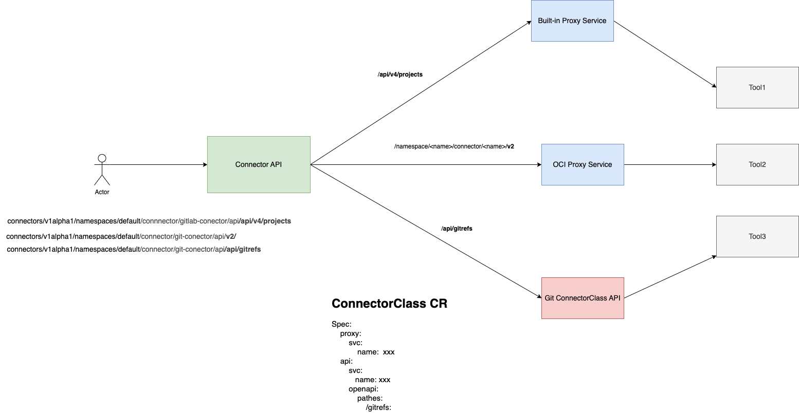
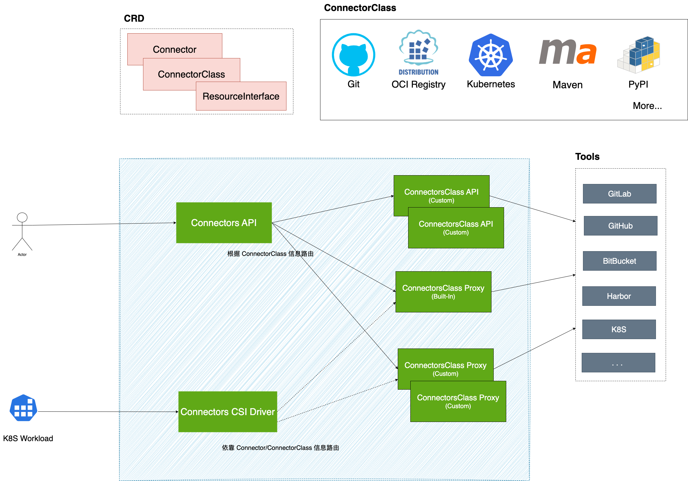

# Connector API 与 动态表单

本文回答以下两个问题

- Connector 如何直接使用 Proxy 提供工具 API 给客户端（动态表单）使用, 结合自定义 API 的实现架构以及实现原则是什么样？
- 在使用了 Connector 的情况下 （Pipeline Integration场景）, 依赖 Connector API 的 UI 组件的动态表单设计是什么样， 技术逻辑是什么 ？

## 各类工具 API 调研 TL;DR

- 请求参数需要提供默认值配置，以减少数据包或符合我们自己的场景。
- 返回的数据结构是不确定，且我们不考虑统一。
- API 针对异常场景的响应是不同的。
- 映射到 UI 字段的展示，存在复杂处理的情况。（拼接编码等）
- API 调用时，传递参数的值，存在复杂处理的情况。（编码，从其他参数获得等）
- 分页模式不尽相同。
- 搜索模式不尽行相同。

### Gitlab  API

**分页**

- page: query, Page number (default: 1).
- per_page: query, Number of items per page (default: 20, max: 100).

**搜索**

- search: query 传递

#### Group List API （可能不需要）

Get /api/v4/groups

**搜索**

query: search 支持

**返回的数据结构**

- 数组，包含了 group 和 subgroup， 数据平铺。

**UI 展示**

- label: $.[*].fullpath
- value: $.[*].fullpath

``` json
[
  {
    "id": 990,
    "web_url": "https://gitlab-ce.alauda.cn/groups/devops/alaudadevops",
    "name": "AlaudaDevOps",
    "path": "alaudadevops",
    "description": "",
    "visibility": "internal",
    "share_with_group_lock": false,
    "require_two_factor_authentication": false,
    "two_factor_grace_period": 48,
    "project_creation_level": "developer",
    "auto_devops_enabled": null,
    "subgroup_creation_level": "maintainer",
    "emails_disabled": null,
    "mentions_disabled": null,
    "lfs_enabled": true,
    "default_branch_protection": 2,
    "avatar_url": null,
    "request_access_enabled": true,
    "full_name": "DevOps / AlaudaDevOps",
    "full_path": "devops/alaudadevops",
    "created_at": "2025-04-14T02:56:47.634Z",
    "parent_id": 8
  },
  {
    "id": 576,
    "web_url": "https://gitlab-ce.alauda.cn/groups/devops/cli",
    "name": "cli",
    "path": "cli",
    "description": "All kinds of clis",
    "visibility": "private",
    "share_with_group_lock": false,
    "require_two_factor_authentication": false,
    "two_factor_grace_period": 48,
    "project_creation_level": "developer",
    "auto_devops_enabled": null,
    "subgroup_creation_level": "maintainer",
    "emails_disabled": null,
    "mentions_disabled": null,
    "lfs_enabled": true,
    "default_branch_protection": 2,
    "avatar_url": null,
    "request_access_enabled": true,
    "full_name": "DevOps / cli",
    "full_path": "devops/cli",
    "created_at": "2022-04-27T00:44:04.722Z",
    "parent_id": 8
  }
]
```

#### Repository List API

Get /api/v4/projects?simple=true

**搜索**

query: search 支持

**返回的数据结构**

- 当前用户可见的代码仓库， 包括subgroup 内的仓库

**UI 展示**

- label: $.[*].name_with_namespace
- value: $.[*].path_with_namespace

```json
[
  {
    "id": 4481,
    "description": "",
    "name": "podman",
    "name_with_namespace": "DevOps / tech-research / podman",
    "path": "podman",
    "path_with_namespace": "devops/tech-research/podman",
    "created_at": "2025-09-28T07:56:32.673Z",
    "default_branch": "master",
    "tag_list": [],
    "topics": [],
    "ssh_url_to_repo": "git@gitlab-ce.alauda.cn:devops/tech-research/podman.git",
    "http_url_to_repo": "https://gitlab-ce.alauda.cn/devops/tech-research/podman.git",
    "web_url": "https://gitlab-ce.alauda.cn/devops/tech-research/podman",
    "readme_url": null,
    "avatar_url": null,
    "forks_count": 0,
    "star_count": 0,
    "last_activity_at": "2025-10-11T08:37:53.494Z",
    "namespace": {
      "id": 842,
      "name": "tech-research",
      "path": "tech-research",
      "kind": "group",
      "full_path": "devops/tech-research",
      "parent_id": 8,
      "avatar_url": null,
      "web_url": "https://gitlab-ce.alauda.cn/groups/devops/tech-research"
    }
  }
]
```

#### Branch List API

`GET /api/v4/projects/{project_id}/repository/branches`

**搜索**

query: search 支持

**参数传递**

- `{project_id}`: 需要对 repository 进行 url encode


**返回的数据结构**

- 数组，包含了 branch 信息

**UI 展示**

- label: $.[*].name
- value: $.[*].name

``` json
[
  {
    "name": "master",
    "merged": false,
    "protected": true,
    "default": true,
    "developers_can_push": false,
    "developers_can_merge": false,
    "can_push": true,
    "web_url": "http://gitlab.example.com/my-group/my-project/-/tree/master",
    "commit": {
      "author_email": "john@example.com",
      "author_name": "John Smith",
      "authored_date": "2012-06-27T05:51:39-07:00",
      "committed_date": "2012-06-28T03:44:20-07:00",
      "committer_email": "john@example.com",
      "committer_name": "John Smith",
      "id": "7b5c3cc8be40ee161ae89a06bba6229da1032a0c",
      "short_id": "7b5c3cc",
      "title": "add projects API",
      "message": "add projects API",
      "parent_ids": [
        "4ad91d3c1144c406e50c7b33bae684bd6837faf8"
      ]
    }
  }
]
```

#### Merge Request List API

`GET /api/v4/projects/{project_id}/merge_requests`

**搜索**

query: search 支持

**参数传递**

- `{project_id}`: 需要对 repository 进行 url encode
- state: opened

**返回的数据结构**

- 数组，包含了 merge request 信息

**UI 展示**

- label: $.[*].iid + $.[*].title
- value: refs/merge-requests/$.[*].iid/merge

``` json
[
  {
    "id": 122978,
    "iid": 1868,
    "project_id": 1008,
    "title": "chore(deps): bump github.com/ulikunitz/xz from v0.5.12 to v0.5.15",
    "description": "## 🔒 Security Updates\n\nThis pull request updates dependencies to fix security vulnerabilities identified by Trivy scanning.\n\n### Go Dependencies\n\n- [MEDIUM]**github.com/ulikunitz/xz**(go.mod): v0.5.12 → v0.5.15\n  - 🔍 Fixes: CVE-2025-58058\n\n## 📊 Update Summary\n\n- **Total packages updated**: 1\n\n## 🤖 Automated by DependaBot\n\nThis PR was automatically created by DependaBot based on Trivy security scan results.\nPlease review the changes and merge if everything looks good.",
    "state": "opened",
    "created_at": "2025-09-01T01:01:53.449Z",
    "updated_at": "2025-09-01T01:24:10.009Z",
    "merged_by": null,
    "merged_at": null,
    "closed_by": null,
    "closed_at": null,
    "target_branch": "release-3.20",
    "source_branch": "dependabot/security-updates-c87d8f7",
    "user_notes_count": 1,
    "upvotes": 0,
    "downvotes": 0,
    "author": {
      "id": 86,
      "name": "alaudabot",
      "username": "alaudabot",
      "state": "active",
      "avatar_url": "https://secure.gravatar.com/avatar/d93536a941e18924cb3519cdcdd34662?s=80&d=identicon",
      "web_url": "https://gitlab-ce.alauda.cn/alaudabot"
    },
    "assignees": [],
    "assignee": null,
    "reviewers": [],
    "source_project_id": 1008,
    "target_project_id": 1008,
    "labels": [
      "dependencies"
    ],
    "draft": false,
    "work_in_progress": false,
    "milestone": null,
    "merge_when_pipeline_succeeds": false,
    "merge_status": "unchecked",
    "sha": "b80bee7a22f83606caf37e318cd182d7ef919ed1",
    "merge_commit_sha": null,
    "squash_commit_sha": null,
    "discussion_locked": null,
    "should_remove_source_branch": null,
    "force_remove_source_branch": null,
    "reference": "!1868",
    "references": {
      "short": "!1868",
      "relative": "!1868",
      "full": "devops/katanomi!1868"
    },
    "web_url": "https://gitlab-ce.alauda.cn/devops/katanomi/-/merge_requests/1868",
    "time_stats": {
      "time_estimate": 0,
      "total_time_spent": 0,
      "human_time_estimate": null,
      "human_total_time_spent": null
    },
    "squash": false,
    "task_completion_status": {
      "count": 0,
      "completed_count": 0
    },
    "has_conflicts": false,
    "blocking_discussions_resolved": true
  }
]
```

#### Tag List API

`GET /api/v4/projects/{project_id}/repository/tags`

**搜索**

query: search 支持

**参数传递**

- `{project_id}`: 需要对 repository 进行 url encode

**返回的数据结构**

- 数组，包含了 tag 信息

**UI 展示**

path: $
- label: item.name
- value: "refs/tags/" + item.name

``` json
[
  {
    "commit": {
      "id": "2695effb5807a22ff3d138d593fd856244e155e7",
      "short_id": "2695effb",
      "title": "Initial commit",
      "created_at": "2017-07-26T11:08:53.000+02:00",
      "parent_ids": [
        "2a4b78934375d7f53875269ffd4f45fd83a84ebe"
      ],
      "message": "Initial commit",
      "author_name": "John Smith",
      "author_email": "john@example.com",
      "authored_date": "2012-05-28T04:42:42-07:00",
      "committer_name": "Jack Smith",
      "committer_email": "jack@example.com",
      "committed_date": "2012-05-28T04:42:42-07:00"
    },
    "release": {
      "tag_name": "1.0.0",
      "description": "Amazing release. Wow"
    },
    "name": "v1.0.0",
    "target": "2695effb5807a22ff3d138d593fd856244e155e7",
    "message": null,
    "protected": true
  }
]

```

#### 待决定问题

**选择代码仓库的体验**

- 先选 group, 再选 group 下的 repository
- 直接选 repository

group 需要聚合人，麻烦。建议直接 list repository。

#### 小结

**Pipeline Integration 体验**

- GitlabCodeRepository 参数
  - repository, 下拉选择。 调用 Repository List API 获取 repository 列表，展示 repository 下拉框。
  - branch/tags/merge request, 下拉选择。 根据用户输入的 repository，调用 List API 获取 对应列表，展示 下拉框。

**技术要求**

- 支持指定分页参数， 从 query 中传递
- 支持指定 search 参数，从 query 中传递
- 支持为 api 请求参数提供默认值
- 支持指定 api 的请求参数为 path/query 内的参数
- 支持 为 api 请求参数值提供计算表达式，支持简单的二次处理
  * 支持来自 pipeline integration 的 params
  * 支持 urlencode: 例如用户选择的 repository 值, urlencode 后作为 api 请求参数值

### Harbor API

**分页**

- page: query, Page number (default: 1).
- page_size: query, Number of items per page (default: 20, max: 100).

**搜索**

大部分api 支持 通过 q 参数来传递搜索内容.

>  Supported query patterns are "exact match(k=v)", "fuzzy match(k=\~v)", "range(k=[min\~max])", "list with union releationship(k={v1 v2 v3})" and "list with intersetion relationship(k=(v1 v2 v3))".

模糊搜索:  key=~value

#### Project List API

`GET /api/v2.0/projects?q=name=~${input.search}`

``` json
[
  {
    "creation_time": "2025-10-24T04:26:44.035Z",
    "current_user_role_id": 1,
    "current_user_role_ids": [
      1
    ],
    "cve_allowlist": {
      "creation_time": "0001-01-01T00:00:00.000Z",
      "id": 204,
      "items": [],
      "project_id": 2487,
      "update_time": "0001-01-01T00:00:00.000Z"
    },
    "metadata": {
      "public": "false"
    },
    "name": "a2-e2eprj-devops",
    "owner_id": 1,
    "owner_name": "admin",
    "project_id": 2487,
    "repo_count": 0,
    "update_time": "2025-10-24T04:26:44.035Z"
  }
]
```

**UI 展示**

path: $
- label: item.name
- value: item.name

#### Repository List API

GET /api/v2.0/repositories

``` json
  {
    "artifact_count": 3,
    "creation_time": "2025-10-20T02:47:49.037Z",
    "id": 632,
    "name": "ops/tektoncd/test-cosign/run-244342",
    "project_id": 221,
    "pull_count": 11,
    "update_time": "2025-10-20T02:51:37.505Z"
  },
  {
    "artifact_count": 3,
    "creation_time": "2025-10-20T02:46:54.735Z",
    "id": 631,
    "name": "ops/tektoncd/test-cosign/run-511530",
    "project_id": 221,
    "pull_count": 11,
    "update_time": "2025-10-20T02:51:57.522Z"
  }
```

**UI 展示**

path: $
- label: item.name
- value: item.name

#### Repository List in Project API

`GET /api/v2.0/projects/{project_name}/repositories`

``` json
[
  {
    "artifact_count": 3,
    "creation_time": "2025-10-22T21:17:35.516Z",
    "id": 637,
    "name": "ops/tektoncd/test-cosign/run-854391",
    "project_id": 221,
    "pull_count": 11,
    "update_time": "2025-10-22T21:22:05.543Z"
  },
  {
    "artifact_count": 3,
    "creation_time": "2025-10-21T21:21:24.345Z",
    "id": 636,
    "name": "ops/tektoncd/test-cosign/run-116830",
    "project_id": 221,
    "pull_count": 11,
    "update_time": "2025-10-21T21:25:25.611Z"
  }
]
```

**参数传递**

- `{project_name}`: 用户选择的 project name

**UI 展示**

path: $
- label: item.name
- value: item.name

#### Tag List API

Harbor 的 API 包装了一层 Artifacts, 一个 Artifact 对应多个 Tag. 数据处理略复杂

`GET /api/v2.0/projects/{project_name}/repositories/{repository_name}/artifacts`

``` json
[
  {
    "accessories": null,
    "artifact_type": "application/vnd.docker.container.image.v1+json",
    "digest": "sha256:aff3958709498501c2badc11023a63ba973535515dde5564876bcb633e97ed5b",
    "extra_attrs": {
      "architecture": "amd64",
      "author": "",
      "config": {
        "Env": [
          "PATH=/usr/local/sbin:/usr/local/bin:/usr/sbin:/usr/bin:/sbin:/bin"
        ],
        "Labels": {
          "build": "tekton",
          "ns": "ops-dev",
          "taskname": "ubuntu-kqd2b-ubuntu-24-04"
        },
        "WorkingDir": "/"
      },
      "created": "2025-02-27T06:53:30.428481657Z",
      "os": "linux"
    },
    "icon": "sha256:0048162a053eef4d4ce3fe7518615bef084403614f8bca43b40ae2e762e11e06",
    "id": 18170,
    "labels": null,
    "manifest_media_type": "application/vnd.docker.distribution.manifest.v2+json",
    "media_type": "application/vnd.docker.container.image.v1+json",
    "project_id": 221,
    "pull_time": "2025-10-22T21:22:01.738Z",
    "push_time": "2025-10-22T21:17:35.710Z",
    "references": null,
    "repository_id": 637,
    "repository_name": "ops/tektoncd/test-cosign/run-854391",
    "size": 30690147,
    "tags": [
      {
        "artifact_id": 18170,
        "id": 6184,
        "immutable": false,
        "name": "latest",
        "pull_time": "2025-10-22T21:22:01.738Z",
        "push_time": "2025-10-22T21:17:35.920Z",
        "repository_id": 637
      },
      {
        "artifact_id": 18170,
        "id": 6184,
        "immutable": false,
        "name": "v1",
        "pull_time": "2025-10-22T21:22:01.738Z",
        "push_time": "2025-10-22T21:17:35.920Z",
        "repository_id": 637
      }
    ],
    "type": "IMAGE"
  }
]
```

**参数传递**

- `{project_name}`: 用户选择的 project name
- `{repository_name}`: PipelineIntegration 中的 Repository Name 值
- with_tag: 为 true

**UI 展示**

展示略复杂。

path: $[*].tags
- label: item.name
- value: item.name

#### 小结

**Pipeline Integration 体验**

- HarborOCIArtifact 三个参数
  - project, 下拉选择。 调用 Project List API 获取 project 列表，展示 project 下拉框。
  - repository, 下拉选择。 根据用户输入的 project，调用 Repository List API 获取 repository 列表，展示 repository 下拉框。
  - tag, 下拉选择。 根据用户输入的 repository，调用 Tag List API 获取 tag 列表，展示 tag 下拉框。
> 如果直接选择 repository， 数据较多，搜索体验不一定好，另外 不利于 harbor cli 的使用。

- API 返回结果映射到前端展示的表达式时，需要应对 tags api 多层数组访问的问题。
- 目前容器平台支持多架构展示，以及架构不匹配情况下的选择禁用，较为复杂。建议先不支持，复杂度较高。

**技术要求**

- 支持指定分页参数名称， 从 query 中传递
- 支持指定 search 参数名称，以及值的计算表达式
  - 计算表达式支持来自当前控件的用户输入。 例如  q="name=~" + input.keyword
- 支持为 api 请求参数提供默认值
- 支持指定 api 的请求参数为 path/query 内的参数
- 支持 为 api 请求参数值提供计算表达式，支持简单的二次处理
  * 支持来自 pipeline integration 的 params

### OCI Distribution API

#### Tags List API

`GET /v2/{name}/tags/list`

``` json
// curl -u "admin:password" -v "https://devops-harbor.alaudatech.net/v2/ops/tektoncd/test-cosign/run-854391/tags/list" | jq .

{
  "name": "ops/tektoncd/test-cosign/run-854391",
  "tags": [
    "latest",
    "sha256-aff3958709498501c2badc11023a63ba973535515dde5564876bcb633e97ed5b.att",
    "sha256-aff3958709498501c2badc11023a63ba973535515dde5564876bcb633e97ed5b.sig"
  ]
}
```

**参数传递**

- `{name}`: PipelineIntegration 中的 Repository Name 值

**UI 展示**

path: $.tags
- label: item
- value: item

#### 补充说明

通过配合如下两个 API

- `GET /v2/{name}/manifests/{reference}`
- `Get /v2/{name}/blobs/{digest}`

才能获某个 tag 对应的制品是何种架构

#### 小结

**Pipeline Integration 体验**

- OCIArtifact 两个参数
  - repository 用户输入
  - tag 下拉选择；根据用户输入的 repository， 调用 Tags List API 获取 tags，展示 tag 下拉框。

**技术要求**

- 相比 gitlab 和 harbor， 无新增要求

### Git API

`GET /connectors/v1alpha1/namespaces/{namespace}/connectors/{name}/resources/gitrefs`

``` json
{
  "items": [
    {
      "name": "refs/heads/main",
      "commitID": "xx"
    }
  ]
}
```

**参数传递**

- `{namespace}`: 用户选择的 connector namespace
- `{name}`: 用户选择的 connector name

**UI 展示**

path: $.items
- label: item.name
- value: item.name

#### 小结

**Pipeline Integration 体验**

- Repository 参数, 用户输入
- revision 下拉选择。 调用 Git API 获取 ref 列表，展示 ref 下拉框。

**技术要求**

- 支持参数值的计算值时，依赖 connector


## 动态表单中的使用提案

### 方案 3 在 ConnectorClass 描述 API 定义 & 动态表增加对 OpenAPI 的标准抽象

- 在 ConnectorClass 中，对 暴露的 API 进行 OpenAPI 的定义
- 动态表单从"支持 OpenAPI 定义 API, 从而获取 API 数据" 的角度，增加对 OpenAPI 的支持

例如

**ConnectorClass 示例**

``` yaml
kind: ConnectorClass
metadata:
  name: gitlab
spec:
  api:
    openapi:
      openapi: 3.0.3
      info:
        title: User API
        version: 1.0.0
      paths:
        /api/v4/projects:
          get:
            operationId: listRepositories
            x-pagination-schema:
              paged-base:
                parameters:
                  page:
                    name: page
                  page_size:
                    name: per_page
            x-search-schema:
              parameters:
                search:
                  name: search
                  # value: "{input.search}"
                  # value: "{'name=~' + input.search}"
            parameters:
              - name: page
                in: query
                description: "Page"
                required: false
                type: integer
              - name: per_page
                in: query
                description: "Items per page"
                required: false
                type: integer
              - name: search
                in: query
                description: "Search"
                required: false
                type: string
              - name: sort
                in: query
                description: "Sort"
                required: false
                schema:
                  type: string
                  default: desc
            responses:
              '200':
                description: 对返回的结果不做数据结构的定义
                content:
                  application/json: {}
```

**ResourceInterface 动态表单描述示例**

``` yaml
# Gitlab 代码仓库的 project 选择
- path: params.project
  x-descriptors:
    # label
    - urn:alm:descriptor:label:en:CodeRepository
    - urn:alm:descriptor:label:zh:CodeRepository
    - ui:select

    # 指定如何获取 openapi
    - api:openapi:url: /connectors.alauda.io/v1alpha1/connectorclasses/${context.connector.spec.connectorclassName}
    - api:openapi:url:path: "spec.api.openapi" # 在返回结果中的路径
    - api:openapi:operationId: listprojects # 对应的 api id

    # 分页相关
    # - api:page:scheme: ${openapi.x-page-scheme}
    - api:page:type: page-based
    - api:page:param:page: ${openapi.parameters.page} # 分页参数在 openapi 中的定义，，当前api 的 page 参数
    - api:page:param:page_size: ${openapi.parameters.per_page}
    - api:page:response:total_page:path: ${openapi.responses.headers["x-total-page"]} # 获取分页返回的总页数
    - api:page:response:total:path: ${openapi.responses.headers["x-total"]}

    # 搜索相关
    # - api:page:scheme: ${openapi.x-search-scheme}
    - api:search:param:search: ${openapi.parameters.search} # 搜索参数在openapi 中的定义，当前api 的 search 参数
    - api:search:param:search:value: ${context.value}

    # 请求时的其他参数传递
    # - api:param:p1:value: ${context.xx} # api 请求时，传递 p1 参数的值如何获取
    # - api:param:p2:value: ${context.xx}
```

### 其他可选方案

#### 直接使用现有动态表单机制

直接在动态表单中，描述 API 的调用方式。 以 代码仓库为例

``` yaml
ui.katanomi.dev/descriptors: |
  - path: params.repository
    x-descriptors:
      # label
      - urn:alm:descriptor:label:en:Repository
      - urn:alm:descriptor:label:zh:Repository
      # component
      - urn:alm:descriptor:com.tectonic.ui:select:aaa
      - urn:alm:descriptor:expression:props.options:api:/connectorclass/${context.connector.spec.connectorClassName}/api/v1alpha1/namespaces/${context.connector.metadata.namespace}/connectors/${context.connector.metadata.name}/-/apis/v4/repositories?simple=true
      - urn:alm:descriptor:expression:props.options:label:path:path_with_namespace
      - urn:alm:descriptor:expression:props.options:label:value:path_with_namespace
```

**缺点**

- 动态表单中，关于 API 后端重复工作量较大，URl 路径，传参默认值，分页逻辑，搜索逻辑，等需要各处重复定义, 后期修改，需要同步修改。

**优点**

- 前端已有动态表单，只需要扩展新的参数支持就可以。对前端冲击小。

#### ConnectorClass 描述 API 定义 & 动态表单中引用 API

- ConnectorClass 中，提供 API 的定义，描述 API 如何定义, 包括分页，搜索如何抽象， 有哪些参数可以传递。
- ResourceInterface 的动态表单中， 关联 API 的 operatorID，描述 API 各个参数值如何从 UI 获取，API 结果如何映射 到 UI 组件

**ResourceInterface 动态表单 annotations 示例**

``` yaml
  # Git 代码仓库的 project 选择
  - path: params.project
    x-descriptors:
      # label
      - urn:alm:descriptor:label:en:CodeRepository
      - urn:alm:descriptor:label:zh:CodeRepository
      # component
      - ui:input
  - path: params.revision
    x-descriptors:
      # label
      - urn:alm:descriptor:label:en:CodeRepository
      - urn:alm:descriptor:label:zh:CodeRepository
      # component
      - ui:select
      - api.connectorField: xxx
      - api.operatorId: gitrefs
      - api.params.project_id: urlencode(context.project)
      - api.resultMapping.path: $[*]
      - api.resultMapping.keyField: name
      - api.resultMapping.valueField: name
```

**优点**

- API 定义中，关于分页，参数的描述是跟随 ConnectorClass 的。 不需要重复定义，修改时，只需要修改一处即可。

**缺点**

- 动态表单需要支持一套完全不同的 DSL , 成本较高。

## 动态表单实现

根据 如上工具的 API 调研， 总结 动态表单设计时，应满足的需求如下，考虑到当前使用场景，同时较少复杂度，建议目前只考虑:

- method: Get
- content-type: application/json

### API Ref

**api 定义参考**

- `api:openapi:url`: 指定通过平台哪个 API 获取 openapi 的数据。 例如 `/connectors.alauda.io/v1alpha1/connectorclasses/${context.connector.spec.connectorclassName}`
- `api:openapi:url:path`: 指定通过 jsonpath 从上述结果中获取 openapi 定义， 例如 `spec.api.openapi`
- `api:openapi:operationId`: 指定指定当前使用的具体的 api id. 例如 `listprojects`

### 分页

**在动态表单中描述分页逻辑**

需要定义出通用的分页抽象协议，要求如下:

- 协议类型可扩展 （page-based, ~~cursor-based~~, token-based, ~~offset-based~~）
- 请求参数的名称和传输位置
  - 定义协议类下含有的元数据
  - 指定元数据映射的请求参数名称
  - 位置支持 query, header 两种
- 支持通过表达式从响应中提取原数据，以及支持部分元数据可选。
  - 表达式支持访问响应的 body, header
  - 表达式支持访问以上数据的任意路径
- 支持不包含分页定义代表不含有分页请求

**举例**

常见的 `paged-base` 分页协议包含如下信息：

- 协议类型: page-based
- 请求参数
  - page 元数据
    - 对应的 api 的参数名称 为 page
    - 如何传输： query
  - page_size 元数据
    - 对应的 api 的参数名称 为 per_page
    - 如何传输： query
- 响应元数据的提取:
  - total 元数据
    - 如何从相应数据提取，例如 `$.body.total`, `$.header.x-total`
  - total_page 元数据
    - 如何从相应数据提取, 例如 `$.body.total_page`, `$.header.x-total-page`

**设计参考**

- `api:page:type`: 分页类型，可选值: page-based, none
  - none: 表示不支持分页
- `api:page:param:page`: 表示 page 参数的来源。支持表达式。
  - 表达式: `${openapi.parameters.<name>}` 表示当前 page 参数对应的是 api 中名称为 `<name>` 的 parameter. openapi定义中，包含了参数名称，传输位置。
- `api:page:param:page_size`: 表示page_size 参数的来源，支持表达式。
  - 表达式: `${openapi.parameters.<name>}`, 表示当前 page 参数对应的是 api 中名称为 `<name>` 的 parameter. openapi定义中，包含了参数名称，传输位置。
- `api:page:response:total_page:path`: 表示如何从响应中获取 total_page 的结果，支持表达式。
  -  表达式: `${api.responses.headers["x-total-page"]}` 表示从 api 相应结果的 header 中获取总页数。

### 搜索

**在 API/动态表单 中描述搜索逻辑**

需要定义通用 API 搜索抽象协议， 要求如下:

- 定义搜索的参数名称和传递位置
  - 支持通过 query 传递搜索参数
- 定义搜索参数的值的计算表达式
  - 支持默认为当前控件输入的值
  - 支持通过表达式计算或获得值
  - 表达式支使用当前控件值进行拼接。
- 不支持 API 搜索的定义

**举例**

1.gitlab 的搜索 api 是通过 query 传递 search 参数实现，

```yaml
search.name: search
search.location: query
search.expression: "${context.value}"
```

2. harbor 的搜索 api 通过 query传递 q 参数实现。q 的值为 key=~value 的形式。

```yaml
search.name: q
search.location: query
search.expression: "name=~${context.value}"
```

3. git 的 gitrefs 是全量返回，api 不支持搜索

```yaml
search.disable: true
```

**设计参考**

- `api:search:param:search`: 搜索参数在 openapi 中的定义，当前api 的 search 参数。 支持表达式
  - 表达式: `${openapi.parameters.<name>}`  表示当前 search 参数对应的是 api 定义 中名称为 `<name>` 的 parameter. openapi定义中，包含了参数名称，传输位置。
  - 不配置时，代表不支持通过api 进行搜索。
- `api:search:param:search:value`: 表示搜索值的定义。 支持表达式。
  - 默认为当前控件的输入值。
  - 表达式: `${'name=~'+ context.value}` 表示拼接用户当前的输入。

### 发起 API 请求依赖的参数值

- 支持从 path, query 中传递参数
- 支持指定参数的默认值为常量值
- 支持指定参数的值来自 pipeline integration connectors & params， 通过表达式计算后获得参数值。
- 表达式支持常见的拼接处理以及函数处理
  - 计算时，input 的数据来源：
    -  connector 的属性信息
    -  pipeline integration params 值
    -  当前控件的输入值 （search 的案例）
-  参数 可能从 query 传递，也可能从 path 中传递，取决于 api 定义。
- query 内传递的参数值需要进行 encode

**设计参考**

- `api:param:<p1>:value`: 表示调用 api 时，p1 参数的值如何计算。支持通过表达式计算，以及设置常量。
  - 表达式: `${context.params.<name>}` , 表示从当前 pipeline integration 名称为 <name> 的 params 上获取的值 作为当前 p1 参数的值
  - 表达式: `${context.connector.<path>}`, 从当前Pipeline Integration 获取connector 的属性信息。 path指向具体字段。
  - 表达式: `${context.value}`
  - 表达式: `${urlencode(${context.params.repository}}`

### API 返回结果映射到 UI 组件

- 支持 API 返回的数据为任意类型
- 支持通过表达式，指定 UI 展示的值如何获取
  - 下拉框的场景
    - 配置 label
    - 配置 value

**设计参考**

- `select:datapath`: jsonpath, 通过 该 jsonpath 从返回的结果中，获取一个数组。
- `select:label`: jsonpath, 遍历 `path` 计算得到的数组中的item，将 item 作为输入， 传递给该 jsonpath,获取label 的值
- `select:value`: 同上


**案例说明**

以下均为真实案例

``` json
// k8s 的常见结构

{
  "items": [
    { "metadata": {"name": "", "namespace": ""} }
  ]
}

// 展示
path: $.items[*]
label: metadata.name
value: metadata.name
```

``` json
// gitlab 返回代码仓库

[
  {
    "name": "",
    "path_with_namespace": ""
  }
]

// 展示
path: $[*]
label: path_with_namespace
value: path_with_namespace
```

``` json
// harbor 返回制品 tag

[
  {
    "name": "",
    "tags": [
      { "name": "v1" },
      { "name": "v2" }
    ]
  },
  {
    "name": "",
    "tags": [
    ]
  },
]

// 展示
path: $[*].tags[*]
label: name
value: name
```

``` json
// oci distribution 返回制品tag

{
  "name": "ops/tektoncd/test-cosign/run-854391",
  "tags": [
    "latest",
    "sha256-aff3958709498501c2badc11023a63ba973535515dde5564876bcb633e97ed5b.att",
    "sha256-aff3958709498501c2badc11023a63ba973535515dde5564876bcb633e97ed5b.sig"
  ]
}

// 展示
path: $.tags[*]
label: $
value: $
```

### 异常场景的处理

- 考虑到异常场景，后端返回数据的不确定性。仅支持针对 http 状态码进行异常判断。

## Connector API 的访问入口

UI 侧使用动态表单加载的 Connector API 服务， 需要平台部署 Conector 组件后暴露出来。

### 提案

**基本思路**



- 客户端请求 connector-api, connector-api 依据当前 connector 的 class 来分析该 API 是由 proxy 提供，还是由 ConnectorClass API 提供。
  - 如果由 Proxy 提供， 则传递 token， 请求 ConnectorClass Proxy Service 的地址(path 或 host), 将 proxy service 的结果透传返回客户端。
  - 如果由 自定义 API 提供，则传递给 ConnectorClass API
- 每个 ConnectorClass Proxy Service 实现 Beare Token 的验证的支持
- 每个 Connector 提供 status.api 记录当前 Connector API 的地址。（可以在 CLI, UI 中使用）
- api路径:
  - `/connectors/api/<connector-namespace>/<connector-name>/path/<path>`: `/connectors/api/default/git1/path/<path>`
  - `/_c/api/<connector-namespace>/<connector-name>/_p/<path>`: `/_c/api/default/git1/_p/<path>`

**优点**

- 部署架构简单， 只需要在 Connectors Core 层面，做统一处理暴露入口即可。 扩展 ConnectorClass 时，不需要关注这个概念。
- 应对 自定义 API 和 使用代理访问 API 两种形式。

**缺点**

- Token 会进行两次校验

### 其他可选方案

**每个 ConnectorClass 都暴露 Proxy， 提供访问工具原始 API 的能力**

- 在 Operator 层面提供能力，将 connectorclass 指定的 proxy 地址，通过 ingress (独立域名，平台地址+Path) 或者nodeport 的方式将 Proxy Service 的地址暴露出来。 地址记录在 Connector Status 上。
- 客户端可以使用该地址，通过访问 Proxy 服务，实现请求工具原始 API 的能力。
- 每一个 proxy service 必须支持 bearer token (SA Token) + path connector 进行权限校验。

例如:

- api: `/connectorclass/<name>/namespaces/<name>/connectors/<connector-name>/<path>`
- ingress 侧进行 rewrite, 请求到 Proxy Service 的地址为 `/namespaces/<name>/connectors/<connector-name>/<path>`
- 不同的 ConnectorClass 暴露的 Proxy 地址方式不同。

**缺点**

- 无法处理 一个 ConnectorClass 同事含有 自定义 API 和 使用代理访问 API 两种形式的场景。 两种方式的 API 地址不同，复杂度暴露到了客户端。

  ``` bash
  # 代理原始工具 API
  Client -> ConnectorClass Proxy Ingress -> ConnectorClass Proxy Service -> Tool Server
  # 自定义 API
  Client -> Connector API -> ConnectorClass API -> Tool Server
  ```

- 每个 connectorclass 的部署，都要分别进行配置以及逻辑处理
- 用户扩展新的 ConnectorClass 需要自行实现该逻辑。

## Global 集群 & 业务集群 Connector API 的访问

- 使用 AIT 提供的 `/clusters-rewrite/<cluster-name>/<ingress-path>/` 来访问业务集群 API
- Connector-API 在集群部署时，增加 ingress `/connectors` 配置
- 动态表单支持指定 API Prefix

``` yaml
- api:openapi:url:prefix: /clusters-rewrite/${context.cluster-name}/connectors/
```

## Connector API 实现原则

-  直接使用 OpenAPI 描述工具API，就能够满足需求，则使用 Proxy Service 配合 ConnectorClass 中的 `spec.api.openapi` 描述来实现。
-  如果依赖的 API 请求涉及到工具的多个 API 的组合，或工具的原始 API 无法满足需求，或当前 ConnectorClass 无 Proxy 实现，此时需要为 ConnectorClass 定义 API。

## 总结概览

整体架构总览



动态表单逻辑总览

- ConnectorClass 提供 API 的 描述信息
- 动态表单引用 OpenAPI 的定义，同时提供前端 API 调用 以及展示 API 数据的 UI 逻辑。
- 根据 Connector 的切换，前端使用不同的 ResourceInterface, 从而使用不同的表单以及表单描述
- 前端根据动态表单的定义， 请求 Connector API， 返回 数据，进行展示

## Design Evaluation

**Reusability**

- 复用已有 Proxy Service

**Simplicity**

- 动态表单属于 Task 创作时，普通用户的使用体验没有影响。
- 扩展新的 ConnectorClass 时，聚焦自己的业务。不需要考虑 API 如何暴露，框架已经提供了暴露的方式。

**Flexibility**

- 工具的 API 复杂度较高，前端无法直接使用时，用户总能通过自定义新 API 来实现 API 调用逻辑的简化。

**Performance**

- `Connector API` 逻辑相对简单，性能压力不大。
- `Built-In Proxy Service` 会成为性能的瓶颈，在其他文档已经阐述。

## Implementation Plan

- **Connector API Framework 调整** --- 1
  - 支持在 ConnectorClass 定义 openapi， 实现 Connector-API 对 直接由代理处理的 API 的转发支持。
  - Connector Status 记录 API 地址。
  - 支持 UI 访问业务集群的 Connector API
- **支持 UI 调用 Git Connector Revision API 完成资源下拉。**  --- 2
  - 为 Git ConnectorClass API 配置 OpenAPI 的描述， 为 GitCodeRepository ResourceInterfacce 增加动态描述。
  - 前置依赖: 动态表单的最终设计
- **支持 UI 调用 Gitlab Connector API 完成代码仓库， 分支， Tags 的选择**  ---- 5
  - 为 Gitlab ConnectorClass API 配置 projects, branches, tags 的 OpenAPI 描述
  - 增加 GitlabCodeRepository ResourceInterface 以及动态表单描述。
  - 前置依赖: 动态表单的最终设计， Gitlab Connector

## Test Plan

**集成测试**

- Connector API 支持转发到 自定义 API 以及 Proxy
- 验证 Git ConnectorClass 中提供的 OpenAPI 描述是否正确？
- 验证 Gitlab ConnectorClass 中提供的 OpenAPI 描述是否正确？